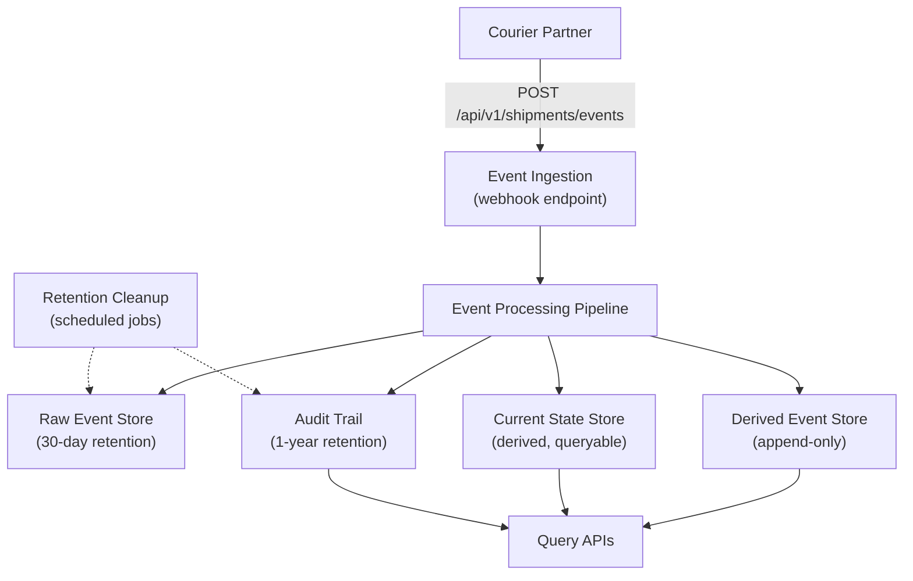
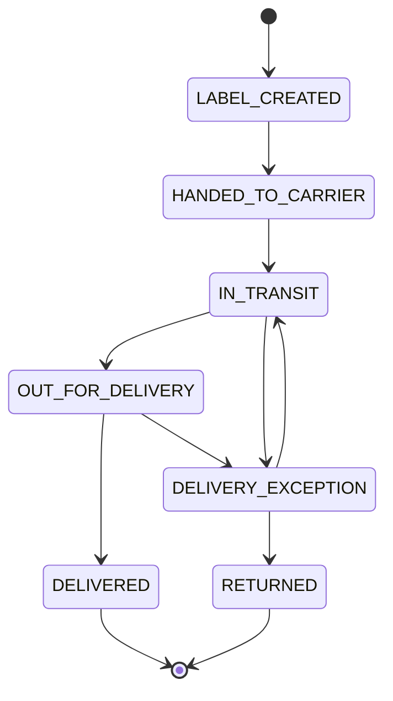

# Shipment Integrity Service

A Spring Boot microservice that receives shipment status updates from courier partners and maintains a trustworthy current shipment state despite duplicates, out-of-order events, and conflicting status updates. Supports single-event and batch ingestion, legal retention enforcement, and a full audit trail.

## Problem

Downstream systems receive the same shipment's events at different times, in different orders, and sometimes duplicated — leading to inconsistent views of shipment state. Customer support, order tracking, and incident response all need a trustworthy answer to "what is the current status of this shipment and how do we know?"

## Solution

This service establishes a single source of truth for shipment state, built on an append-only event audit log. Every event is stored regardless of outcome. Every state derivation decision is recorded with its rationale.

## Tech Stack

- **Runtime:** Java 17, Spring Boot 3.5.0, Maven
- **Persistence:** SQLite with Spring Data JPA / Hibernate
- **Port:** `8080`

## Architecture



### Key Processing Rules

1. **Deduplication**: `(partner, eventId)` uniquely identifies an event. Duplicates are rejected with `reason="DUPLICATE_EVENT"`. Database enforces UNIQUE constraint on `(partner, event_id)`.

2. **Event Ordering**: `receivedAt` is the authoritative timestamp. `occurredAt` is stored for audit but not used for ordering — it is unreliable due to clock skew and backfills.

3. **State Transitions**: Only defined transitions are allowed. Invalid transitions are persisted but marked rejected.

4. **Out-of-Order Handling**: Events with older `receivedAt` than current state are stored but do NOT update current state.

5. **Newer Events**: When a newer event arrives with a valid transition, update `shipment_current_state`.

6. **Terminal States**: `DELIVERED` and `RETURNED` are terminal. All incoming events are rejected.

7. **Batch Processing**: Each event in a batch is processed independently. One bad event does not poison the batch.

8. **Retention**: Raw partner payloads are deleted after 30 days (legal requirement). Audit decisions are retained for 1 year (legal requirement). Terminal-state shipments are exempt.

### Status Transitions



### Extensibility

`ShipmentStateResolver` is a pluggable interface for custom state resolution logic.

```java
public interface ShipmentStateResolver {
    ShipmentResolutionResult resolve(
        ShipmentEventEntity incoming,
        ShipmentCurrentStateEntity current
    );
}
```

Implement and register as a Spring bean to add a custom resolver.

## API Endpoints

| Method | Path | Description |
|--------|------|-------------|
| POST | `/api/v1/shipments/events` | Receive single event or batch (auto-detected) |
| GET | `/api/v1/shipments/{shipmentId}/status` | Query current status |
| GET | `/api/v1/shipments/{shipmentId}/events` | Query event history |
| GET | `/api/v1/shipments/{shipmentId}/audit` | Query audit decision log |
| GET | `/health` | Health check |

### Example Event

```json
{
  "eventId": "evt-123",
  "partner": "dhl",
  "shipmentId": "ship-456",
  "status": "IN_TRANSIT",
  "occurredAt": "2026-03-10T12:00:00Z",
  "receivedAt": "2026-03-10T12:00:05Z",
  "location": "Amsterdam"
}
```

### Batch Request (bare array)

```json
[
  {
    "eventId": "evt-1",
    "partner": "dhl",
    "shipmentId": "ship-456",
    "status": "LABEL_CREATED",
    "occurredAt": "2026-03-10T12:00:00Z",
    "receivedAt": "2026-03-10T12:00:05Z"
  },
  {
    "eventId": "evt-2",
    "partner": "dhl",
    "shipmentId": "ship-456",
    "status": "HANDED_TO_CARRIER",
    "occurredAt": "2026-03-10T13:00:00Z",
    "receivedAt": "2026-03-10T13:00:05Z"
  }
]
```

## Common Commands

```bash
# Build
mvn clean package

# Run the application
mvn spring-boot:run

# Run tests
mvn test

# Run a single test class
mvn test -Dtest=ShipmentStatusTest
mvn test -Dtest=DefaultShipmentStateResolverTest
mvn test -Dtest=ShipmentIntegrationTest
```

## Documentation

Detailed documentation is maintained in `docs/`:

| Document | Description |
|----------|-------------|
| [SUBMISSION.md](docs/SUBMISSION.md) | Complete submission document |
| [API.md](docs/API.md) | Full API reference |
| [REQUIREMENTS.md](docs/REQUIREMENTS.md) | Functional and non-functional requirements |
| [ARCHITECTURE.md](docs/ARCHITECTURE.md) | Component boundaries and processing flow |
| [ADR.md](docs/ADR.md) | Architecture decision records |
| [SEQUENCE_DIAGRAM.md](docs/SEQUENCE_DIAGRAM.md) | Sequence diagrams |
| [DELIVERY_PLAN.md](docs/DELIVERY_PLAN.md) | Delivery plan |
| [RISK_REGISTER.md](docs/RISK_REGISTER.md) | Risks and mitigations |
| [TECHNICAL_STRATEGY_MEMO.md](docs/TECHNICAL_STRATEGY_MEMO.md) | Technical strategy |
| [QA.md](docs/QA.md) | Client Q&A |
| [CHANGE_REQUEST.md](docs/CHANGE_REQUEST.md) | Change request for batch and retention |
