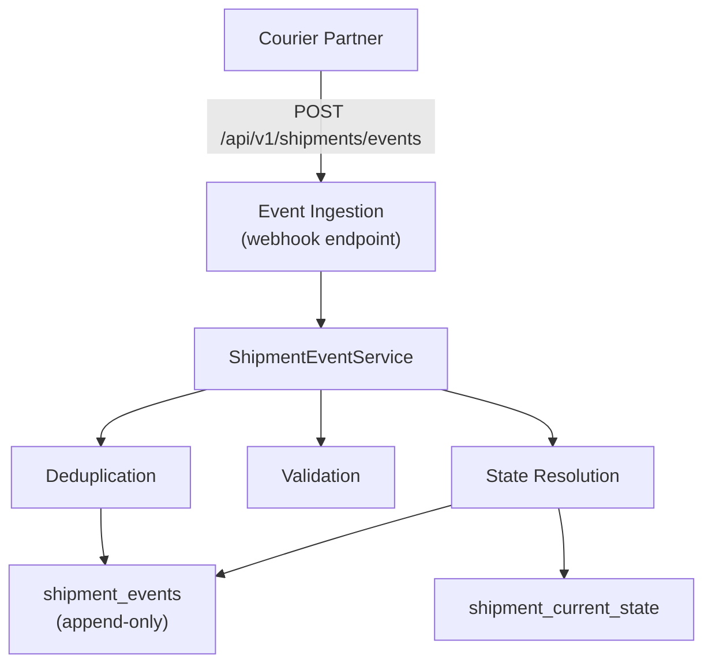
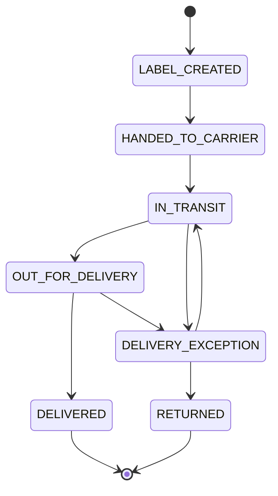

# Shipment Integrity Service

**Status:** Phase 1 complete

A Spring Boot microservice that receives shipment status updates from courier partners and maintains a trustworthy current shipment state despite duplicates, out-of-order events, and conflicting status updates.

## Problem

Downstream systems receive the same shipment's events at different times, in different orders, and sometimes duplicated - leading to inconsistent views of shipment state. Customer support, order tracking, and incident response all need a trustworthy answer to "what is the current status of this shipment and how do we know?"

## Solution

This service establishes a single source of truth for shipment state, built on an append-only event audit log. Every event is stored regardless of outcome. Every state derivation decision is recorded with its rationale.

## Tech Stack

- **Runtime:** Java 17, Spring Boot 3.5.0, Maven
- **Persistence:** SQLite with Spring Data JPA / Hibernate
- **Port:** `8080`

## Architecture



### Key Processing Rules

1. **Deduplication**: `(partner, eventId)` uniquely identifies an event. Duplicates are rejected with `reason="DUPLICATE_EVENT"`. Database enforces UNIQUE constraint on `(partner, event_id)`.

2. **Event Ordering**: Use `receivedAt` (ingestion time) as authoritative timestamp. `occurredAt` is stored for audit but not used for ordering - it is unreliable due to clock skew and backfills.

3. **State Transitions**: Only defined transitions are allowed (see Status Transitions below). Invalid transitions are persisted but marked rejected.

4. **Out-of-Order Handling**: Events with older `receivedAt` than current state are stored but do NOT update current state. History is preserved; current state is unchanged.

5. **Newer Events**: When a newer event arrives with a valid transition, update `shipment_current_state`.

6. **Terminal States**: `DELIVERED` and `RETURNED` are terminal. All incoming events are rejected - no further transitions are allowed.

### Status Transitions



### Extensibility

`ShipmentStateResolver` is a pluggable interface for custom state resolution logic (e.g., courier-specific rules, batch ingestion, conflict handling).

```java
public interface ShipmentStateResolver {
    ShipmentResolutionResult resolve(
        ShipmentEventEntity incoming,
        ShipmentCurrentStateEntity current
    );
}
```

Implement and register as a Spring bean to add a custom resolver.

## API Endpoints

| Method | Path | Description |
|--------|------|-------------|
| POST | `/api/v1/shipments/events` | Receive shipment event |
| GET | `/api/v1/shipments/{shipmentId}/status` | Query current status |
| GET | `/health` | Health check |

### Example Event

```json
{
  "eventId": "evt-123",
  "partner": "dhl",
  "shipmentId": "ship-456",
  "status": "IN_TRANSIT",
  "occurredAt": "2026-03-10T12:00:00Z",
  "receivedAt": "2026-03-10T12:00:05Z",
  "location": "Amsterdam"
}
```

## Common Commands

```bash
# Build
mvn clean package

# Run the application
mvn spring-boot:run

# Run tests
mvn test

# Run a single test class
mvn test -Dtest=ShipmentStatusTest
mvn test -Dtest=DefaultShipmentStateResolverTest
mvn test -Dtest=ShipmentIntegrationTest
```

## Documentation

Detailed documentation is maintained in `docs/`:

| Document | Description |
|----------|-------------|
| [REQUIREMENTS.md](docs/REQUIREMENTS.md) | Functional and non-functional requirements |
| [ARCHITECTURE.md](docs/ARCHITECTURE.md) | Component boundaries, event processing flow, domain model |
| [ADR.md](docs/ADR.md) | Architecture decision records |
| [SEQUENCE_DIAGRAM.md](docs/SEQUENCE_DIAGRAM.md) | Sequence diagrams for ingestion, resolution, and queries |
| [DELIVERY_PLAN.md](docs/DELIVERY_PLAN.md) | Phased delivery plan |
| [RISK_REGISTER.md](docs/RISK_REGISTER.md) | Risks, likelihood/impact assessments, mitigations |
| [TECHNICAL_STRATEGY_MEMO.md](docs/TECHNICAL_STRATEGY_MEMO.md) | Problem framing, data integrity strategy, operational concerns |
| [QA.md](docs/QA.md) | Client Q&A |

## Pending Work

See `docs/TASKS.md` for the full task list. Notable pending items:

- Event History Query API (`GET /api/v1/shipments/{shipmentId}/events`)
- Batch Ingestion endpoint
- Event Quarantine for invalid events
- OpenAPI/Swagger documentation
