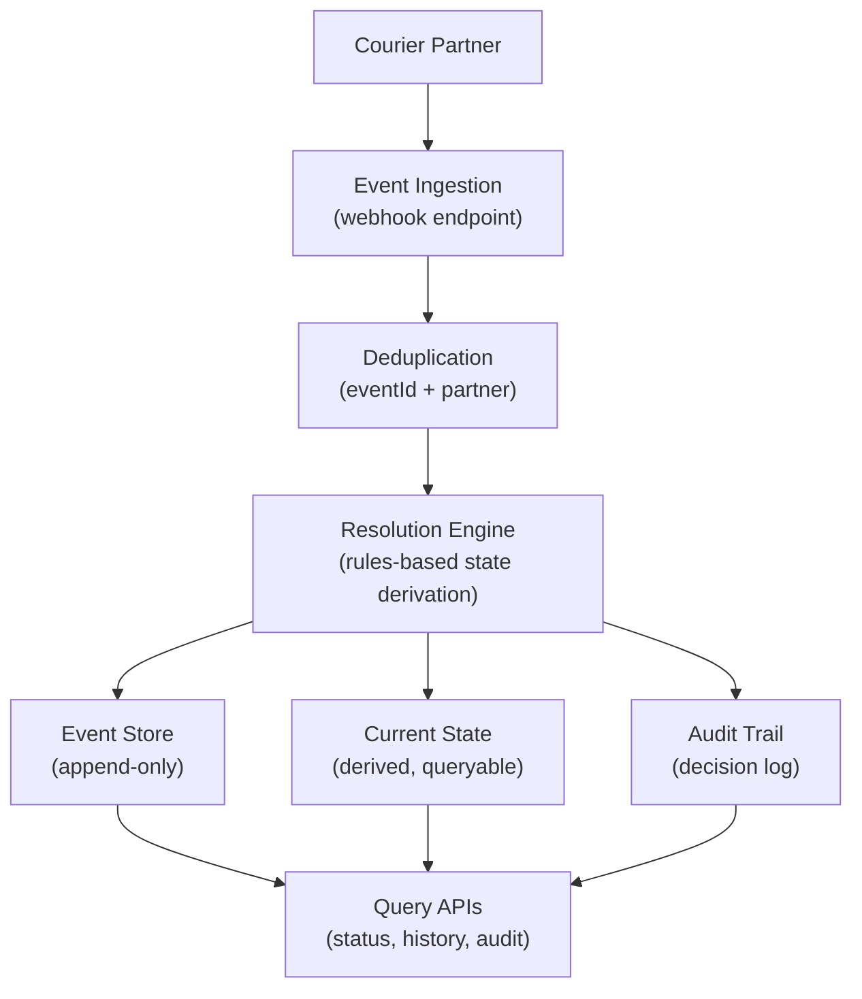
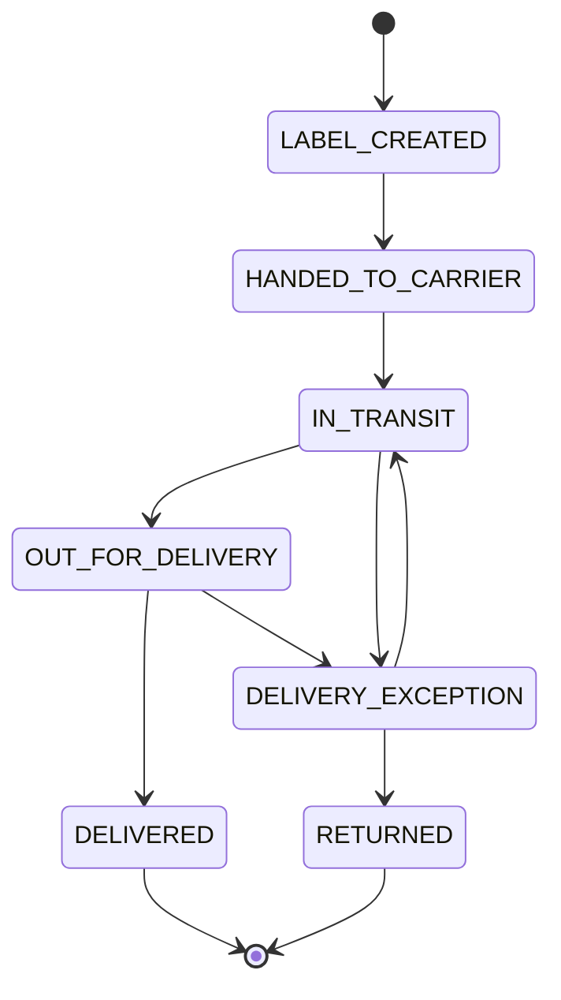
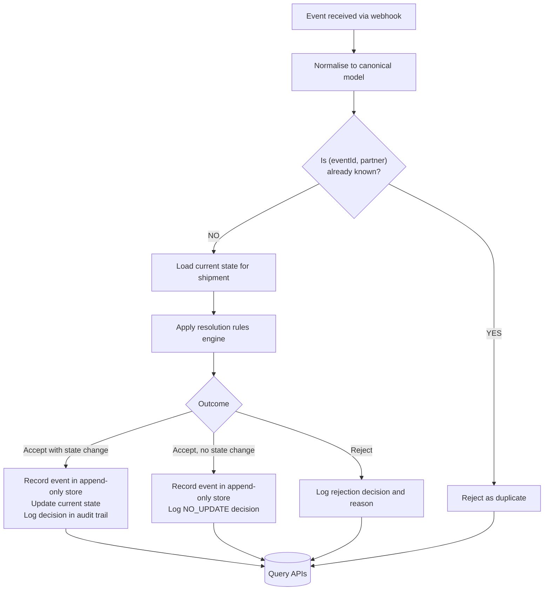

# Architecture

**Date:** 2026-06-15
**Status:** Draft

---

## Overview

The system receives shipment events from a courier partner via webhook, resolves the authoritative current state per shipment, and exposes query interfaces for status, event history, and audit trail.

The architecture is organised around three concerns:

- **Ingestion** - receive and normalise events from the partner
- **Resolution** - derive current state from the event sequence using a deterministic rules engine
- **Query** - serve current state, history, and audit data to internal consumers

---

## Component Boundaries

### Event Ingestion

Incoming events are received via a single webhook endpoint that accepts both single events and batch arrays. The request body is mapped directly into the canonical `ShipmentEventRequest` model — no partner-specific transformation occurs at this stage.

> **Note:** A normalisation layer (partner-specific payload mapping) is planned for a future phase to support multiple courier partners.

### Deduplication

A uniqueness check ensures each event is processed once. The check is scoped to the partner - `(eventId, partner)` is the deduplication key.

### Resolution Engine

A deterministic rules engine evaluates each incoming event against the current known state and produces an outcome: accept (with or without a state change), or reject. The engine is stateless - the same inputs always produce the same outcome.

### Event Store

An append-only store of all accepted events. Events are never modified or deleted once written. This provides a complete, queryable history and enables deterministic replay.

### Current State

A derived view of the latest known state per shipment. Updated whenever an accepted event produces a new status.

### Audit Trail

A complete, immutable log of every resolution decision - whether an event was accepted, rejected, or produced no state change - and the reasoning behind each decision.

---

## Domain

### Shipment Status Values

Allowed transitions are defined by the status taxonomy. `DELIVERED` and `RETURNED` are terminal - no further events are accepted for a shipment in either state.

---

## Event Processing Flow

### Resolution Outcomes

| Outcome | Meaning | Stored |
|---------|---------|--------|
| Accept with state change | Event is valid and updates current status | Event + new state + audit decision |
| Accept, no state change | Event is valid but older than known state | Event + audit decision |
| Reject | Event violates transition rules | Audit decision with reason |

---

## Key Design Decisions

| Decision | Rationale |
|----------|-----------|
| Canonical event model at ingestion | Isolates partner-specific payload format from core logic; new partners require only a new normaliser |
| Per-partner deduplication key `(eventId, partner)` | Handles partner-scoped IDs without requiring globally unique event IDs |
| `receivedAt` for ordering, `occurredAt` for audit | Uses the partner's ingestion timestamp as the authoritative signal; `occurredAt` is stored for audit only |
| Deterministic, stateless resolution engine | Identical event sequences always produce identical state; easy to test and reason about |
| Append-only event store with derived current state | Complete history preserved for audit and replay; current state available via fast query |
| Audit trail records every decision | Full traceability: why state changed or didn't change is always explainable |

---

## Related Documents

- [OVERVIEW.md](OVERVIEW.md) - Project context, goals, and scope
- [REQUIREMENTS.md](REQUIREMENTS.md) - Functional and non-functional requirements
- [QA.md](QA.md) - Client questions and answers
- [TECHNICAL_STRATEGY_MEMO.md](TECHNICAL_STRATEGY_MEMO.md) - Strategy, data integrity approach, and operational concerns
- [DELIVERY_PLAN.md](DELIVERY_PLAN.md) - Phased delivery plan
- [RISK_REGISTER.md](RISK_REGISTER.md) - Risks and mitigations