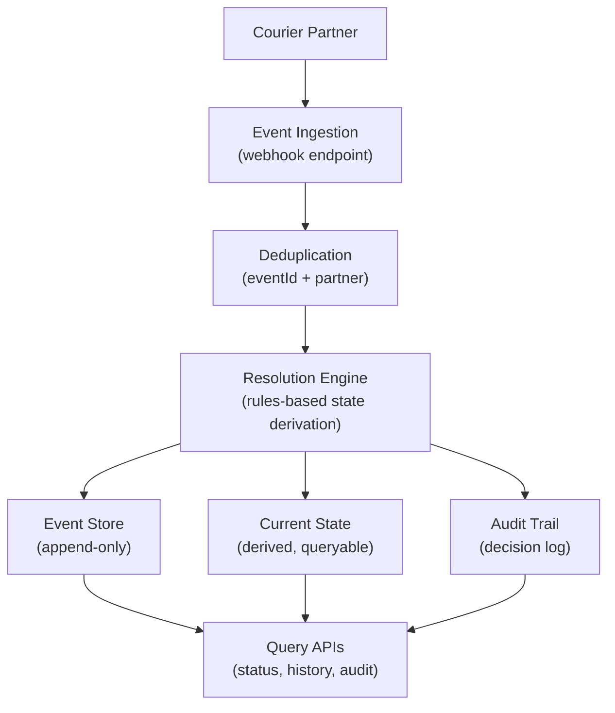
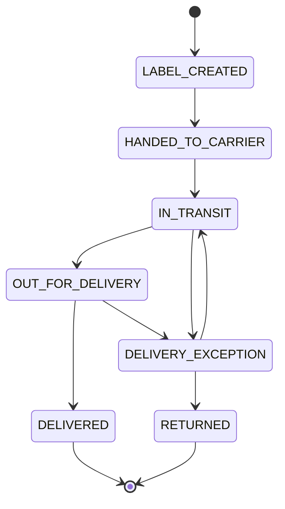
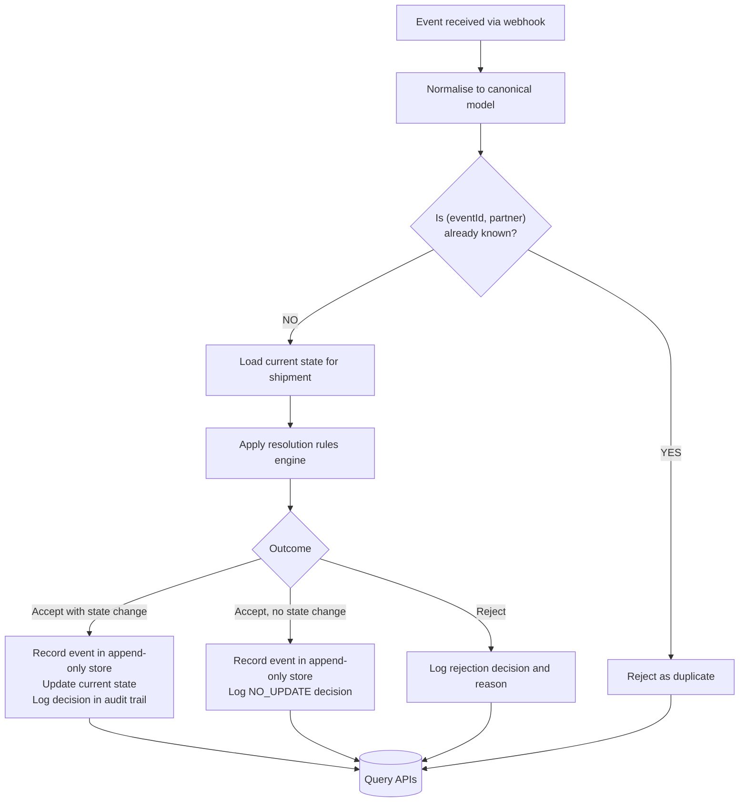
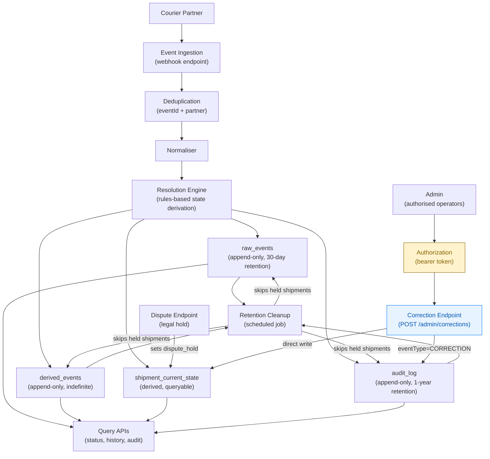

# Architecture

**Date:** 2026-06-15
**Status:** Draft

---

## Overview

The system receives shipment events from a courier partner via webhook, resolves the authoritative current state per shipment, and exposes query interfaces for status, event history, and audit trail.

The architecture is organised around three concerns:

- **Ingestion** - receive and normalise events from the partner
- **Resolution** - derive current state from the event sequence using a deterministic rules engine
- **Query** - serve current state, history, and audit data to internal consumers

---

## Component Boundaries



### Event Ingestion

Incoming events are received via a single webhook endpoint that accepts both single events and batch arrays. The request body is mapped directly into the canonical `ShipmentEventRequest` model — no partner-specific transformation occurs at this stage.

> **Note:** A normalisation layer (partner-specific payload mapping) is planned for a future phase to support multiple courier partners.

### Deduplication

A uniqueness check ensures each event is processed once. The check is scoped to the partner - `(eventId, partner)` is the deduplication key.

### Resolution Engine

A deterministic rules engine evaluates each incoming event against the current known state and produces an outcome: accept (with or without a state change), or reject. The engine is stateless - the same inputs always produce the same outcome.

### Event Store

An append-only store of all accepted events. Events are never modified or deleted once written. This provides a complete, queryable history and enables deterministic replay.

### Current State

A derived view of the latest known state per shipment. Updated whenever an accepted event produces a new status.

### Audit Trail

A complete, immutable log of every resolution decision - whether an event was accepted, rejected, or produced no state change - and the reasoning behind each decision.

---

## Domain

### Shipment Status Values



Allowed transitions are defined by the status taxonomy. `DELIVERED` and `RETURNED` are terminal - no further events are accepted for a shipment in either state.

---

## Event Processing Flow



### Resolution Outcomes

| Outcome | Meaning | Stored |
|---------|---------|--------|
| Accept with state change | Event is valid and updates current status | Event + new state + audit decision |
| Accept, no state change | Event is valid but older than known state | Event + audit decision |
| Reject | Event violates transition rules | Audit decision with reason |

---

## Key Design Decisions

| Decision | Rationale |
|----------|-----------|
| Canonical event model at ingestion | Isolates partner-specific payload format from core logic; new partners require only a new normaliser |
| Per-partner deduplication key `(eventId, partner)` | Handles partner-scoped IDs without requiring globally unique event IDs |
| `receivedAt` for ordering, `occurredAt` for audit | Uses the partner's ingestion timestamp as the authoritative signal; `occurredAt` is stored for audit only |
| Deterministic, stateless resolution engine | Identical event sequences always produce identical state; easy to test and reason about |
| Append-only event store with derived current state | Complete history preserved for audit and replay; current state available via fast query |
| Audit trail records every decision | Full traceability: why state changed or didn't change is always explainable |

---

## Related Documents

- [OVERVIEW.md](OVERVIEW.md) - Project context, goals, and scope
- [REQUIREMENTS.md](REQUIREMENTS.md) - Functional and non-functional requirements
- [QA.md](QA.md) - Client questions and answers
- [TECHNICAL_STRATEGY_MEMO.md](TECHNICAL_STRATEGY_MEMO.md) - Strategy, data integrity approach, and operational concerns
- [DELIVERY_PLAN.md](DELIVERY_PLAN.md) - Phased delivery plan
- [RISK_REGISTER.md](RISK_REGISTER.md) - Risks and mitigations

---

## DDD Alternative Structure

The current codebase organises code by technical layer. Domain-Driven Design organises code by domain concept. Both use Spring Boot — DDD is an architectural pattern, not a technology choice.

### Current vs DDD package structure

```
Current (layered by technical concern):

/controller    ─ HTTP endpoints
/service       ─ orchestration + business logic
/domain        ─ ShipmentStatus enum only
/entity        ─ JPA entities (DB tables)
/dto           ─ API payloads
/repository    ─ Spring Data JPA interfaces

---

DDD (layered by domain concept):

/presentation
  /controllers  ─ HTTP endpoints
  /dto         ─ API contracts only

/application
  /commands     ─ write use cases
  /queries      ─ read use cases (CQRS)

/domain
  /model        ─ Aggregates, entities, value objects
  /events       ─ Domain events
  /services     ─ Domain services (e.g. ShipmentResolver)
  /repositories ─ Repository interfaces (contracts, not implementations)

/infrastructure
  /persistence  ─ Repository implementations
  /messaging    ─ Domain event publishing
```

### DDD component interaction

```mermaid
graph TD
    Courier["Courier Partner"] --> |POST /api/v1/shipments/events| Controller["Controller\n/presentation/controllers"]
    Controller --> |receiveEvent(cmd)| AppService["Application Service\n/application/commands"]
    AppService --> |load + apply| Aggregate["Shipment AGGREGATE ROOT\n/domain/model"]
    Aggregate --> |emits| DomainEvent["Domain Event\n/domain/events"]
    DomainEvent --> |publish| EventBus["Event Bus\n/infrastructure/messaging"]
    EventBus --> |notify| AuditLogger["Audit Logger\n/listens to domain events"]
    AppService --> |save| RepoImpl["JpaShipmentRepository\n/infrastructure/persistence"]
    RepoImpl --> |implements| RepoIf["ShipmentRepository interface\n/domain/repositories"]
    Aggregate --> |validate| Resolver["ShipmentResolver\n/domain/services"]
```

### The Shipment aggregate

In DDD, the `Shipment` aggregate is the core domain object. It owns its state and enforces its own rules — no external service tells it what to do.

```java
// /domain/model/Shipment.java

public class Shipment {

    private ShipmentId id;
    private ShipmentStatus status;
    private Instant lastReceivedAt;
    private Instant lastOccurredAt;
    private String location;

    // Outside code calls this — the aggregate enforces the rules
    public void applyEvent(ShipmentEvent event) {
        if (event.getReceivedAt().isBefore(this.lastReceivedAt)) {
            throw new OutOfOrderEventException(event.getId());
        }
        if (!status.canTransitionTo(event.getStatus())) {
            throw new InvalidTransitionException(status, event.getStatus());
        }

        this.status = event.getStatus();
        this.lastReceivedAt = event.getReceivedAt();
        this.lastOccurredAt = event.getOccurredAt();
        this.location = event.getLocation();

        // Emit domain event for audit trail
        DomainEvents.publish(new StatusChangedEvent(...));
    }
}
```

Key: state can only be changed through the aggregate. Outside code never directly sets `status = IN_TRANSIT` — it calls `shipment.applyEvent(event)` and the aggregate decides whether to accept it.

### What stays the same

- Spring Boot — the runtime container, HTTP, DI, transactions, scheduling are all unchanged
- Database schema — same tables, same JPA backing classes
- HTTP endpoints — controllers remain, they just delegate to application services
- The `ShipmentStateResolver` interface — still pluggable, still the extension point

### What changes

| Aspect | Current | DDD |
|--------|---------|-----|
| State ownership | `ShipmentEventService` + `ShipmentStateResolver` | `Shipment` aggregate owns its state |
| Business logic location | Spread across service and resolver classes | Lives in the aggregate and domain services |
| Repository interfaces | In `/repository` (technical layer) | In `/domain/repositories` — domain declares what it needs |
| Audit trail | Writes to `audit_log` table | Domain events published: `ShipmentReceived`, `StatusChanged`, `EventRejected` |
| Application service | `ShipmentEventService` (mixed orchestration + logic) | `/application` layer — orchestrates aggregates, handles transactions |

### Is it worth it for this project?

For a thin slice with a single bounded context and one courier partner — no. The current structure is appropriate. DDD's strength is managing complexity in large domains with multiple aggregates, complex invariants, and team boundaries.

It becomes worth it if: Partner B onboarding adds significant domain complexity, multiple teams work on the same codebase, or the domain logic grows enough that spread-out service classes become harder to reason about.

See also: [CODE_LAYERS.md](CODE_LAYERS.md) — current code layer reference

---

## Post-Change Request Architecture

The mandatory change request introduced three architectural changes: batch ingestion, legal retention, and Partner B preparation. The resulting architecture has three separate event stores, each with a distinct purpose and retention policy.



### Three-Store Model

| Store | Written by | Purpose | Retention |
|-------|-----------|---------|-----------|
| **raw_events** | Ingestion (after dedup) | Exact partner input — raw payloads for legal compliance and dispute evidence | 30 days |
| **derived_events** | Resolution Engine | Canonical business transitions — deduplicated, ordered, validated events driving current state | Indefinite |
| **audit_log** | Resolution Engine | Every resolution decision and its reasoning — for traceability and debugging | 1 year |
| **shipment_current_state** | Resolution Engine | Derived current state per shipment — O(1) status lookups | Indefinite |

### Data Flow

1. Partner sends event(s) via webhook
2. Deduplication check — `(eventId, partner)` uniqueness
3. Events normalised to canonical model
4. Resolution Engine evaluates each event:
   - **raw_events** written immediately (after dedup)
   - Resolution decision computed using `receivedAt` ordering
   - If accepted: **derived_events** and **current_state** updated
   - Every decision logged to **audit_log**
5. Query APIs serve status, history, and audit from the appropriate store

### Retention Cleanup

The cleanup job runs on a schedule and deletes records past their retention window. Before deleting, it checks the `dispute_hold` flag on `shipment_current_state` — held shipments are skipped.

The **dispute endpoint** (`POST /api/v1/shipments/{shipmentId}/disputes`) sets `dispute_hold = true`, exempting that shipment's records from cleanup. The hold is cleared when the dispute is resolved.

---

## Correction Implementation

Corrections address a different problem from disputes: where disputes preserve evidence, corrections change the authoritative state. A correction is needed when a terminal state is wrong — the shipment was delivered to the wrong address, or returned when it wasn't.

Corrections are a separate path from normal event processing. They bypass the Resolution Engine entirely.

### How corrections work

```
Admin → POST /api/v1/admin/shipments/{shipmentId}/corrections
         Authorization: Bearer <operator-token>

         {
           "correctedStatus": "IN_TRANSIT",
           "reason": "wrong_address",
           "note": "Customer called to report incorrect delivery address"
         }
```

The correction endpoint is separate from the normal webhook. It requires bearer token authentication. The operator's permissions are checked against a permissions matrix — an operator might be allowed to correct `DELIVERED → IN_TRANSIT` but not `DELIVERED → RETURNED`.

### What corrections write

| Store | Written? | Why |
|-------|----------|-----|
| `raw_events` | No | Corrections are not courier events — they are administrative overrides |
| `derived_events` | No | Corrections are not canonical business events |
| `shipment_current_state` | Yes — direct write | The correction changes the authoritative state |
| `audit_log` | Yes — enriched | Records `eventType=CORRECTION`, `authorisedBy`, `correctionReason` |

### Corrections vs the state machine

The state machine is not consulted. A correction says "set the state to X regardless of what the state machine says." This is deliberate — a correction is not a courier event, it is an administrative override. The state machine governs how shipments move based on courier events; corrections govern how humans correct errors.

Once corrections exist, no state is truly terminal. `DELIVERED` means "the normal delivery process completed, unless someone corrects it." The correction path can restart the journey.

### What changes to the state machine

`DELIVERED` and `RETURNED` remain valid terminal states for the normal event path. In the correction path, they are non-terminal — corrections can exit them.

The resolver branches on `eventType`:
- `NORMAL` → existing transition logic
- `CORRECTION` → bypasses state machine, direct state override

### Summary of stores and paths

| Path | raw_events | derived_events | current_state | audit_log |
|------|-----------|---------------|---------------|-----------|
| Normal event | Written | Written | Written/updated | Written |
| Dispute raised | Exempt from cleanup | Exempt | `dispute_hold = true` | Written |
| Correction | Not written | Not written | Direct write | Written (enriched) |
| Dispute resolved | Cleanup resumes | Cleanup resumes | `dispute_hold = false` | — |

---

## Pre-Change Request Architecture (Original)

The diagram above replaced the original single-event-store architecture. The original design had:

- One append-only event store (now split into `raw_events` and `derived_events`)
- No separate audit log (now a dedicated `audit_log` store)
- `@EnableScheduling` removed (re-added to support cleanup jobs)
- `occurredAt` used for ordering (updated to `receivedAt` per ADR-001, with the confirmed bug)

This section is retained for historical reference.