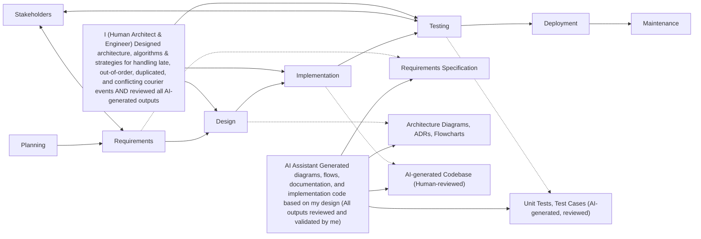

# Development Process Note

## AI Tool Usage

**Tools used:**  
Claude Code, ChatGPT, Claude.io

**What they produced:**  

I followed a human in the loop approach. I used the software development life cycle (SDLC) process for the software development process.  

**What I overrode or verified myself:**  
The AI produced a fairly elaborate repository structure. I verified this against the actual repository structure and made practical adjustments — the project has a flatter structure than the AI assumed, so some of the suggestions were not applicable. I reviewed the mental model against the existing folder contents and confirmed the overall split was sound, but trimmed the scope to match what the project actually needed.

I extracted the requirements from the assignment doc in markdown. I reviewed the requirements and made the assumptions where the brief was underspecified. I clarified some questions with the stakeholder, reviewed the requirements and updated using Claude to update with my suggestions.

I designed the architecture and algorithms and strategies required to address the courier events arriving late, out of order, duplicated, or with conflicting data. I used AI to create the diagrams, flows and the artifacts associated with each and then reviewed it. 

Next I implemented the software slice using AI. I used the artefacts produced as inputs for code generation. I reviewed what was produced and updated accordingly using AI.

I committed changes to GitHub systematically as I progressed. 

**Example where my judgment differed from the AI's suggestion:**  
AI implemented ingestion using separate endpoints for batching and single events. I changed it to make use of a single endpoint that receives both types. I introduced the changes using AI and then retested. 

AI did not understand the distinction between receivedAt and occurredAt in the real world scenario. It suggested using receivedAt for the ordering. I used my judgement and changed it to occurredAt since it is considered as the time of the event happening. 

