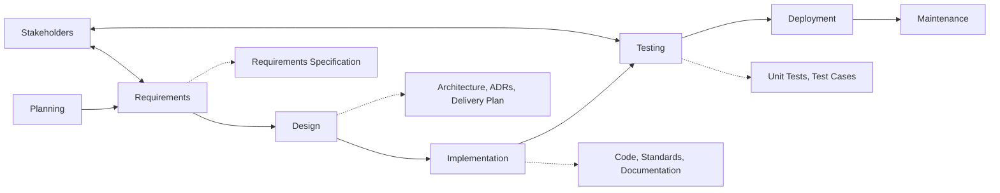

# Development Process Note

## AI Tool Usage

**Tools used:**  
Claude Code, ChatGPT

**What they produced:**  
ChatGPT produced guidance on README structure and documentation organisation — specifically a mental model for separating README (onboarding + navigation), `/docs` (design + reasoning + deep system truth), and `src/`-level READMEs (local context per module). This included the key divider: if it helps someone start/run/navigate → README; if it helps someone design or reason deeply → docs; if it helps someone understand one module only → src README. ChatGPT also produced a flow diagram of the SDLC (Planning → Requirements → Design → Implementation → Testing → Deployment → Maintenance) with stakeholder feedback loops.

**What I overrode or verified myself:**  
The AI produced a fairly elaborate three-layer documentation structure including `src/`-level READMEs for each module. I verified this against the actual repository structure and made practical adjustments — the project has a flatter structure than the AI assumed, so some of the module-level README suggestions were not applicable. I reviewed the mental model against the existing `docs/` folder contents and confirmed the overall split was sound, but trimmed the scope to match what the project actually needed.

**Example where my judgment differed from the AI's suggestion:**  
ChatGPT suggested including a "Key Concepts" section in the README with bullets like "events are immutable", "state is derived, not stored", and "ordering is deterministic". I judged that adding this section would be speculative — the existing README already communicates the core idea without it, and adding theoretical bullets could create confusion rather than clarity. Instead, I preferred to let the architecture speak through the existing diagrams and keep the README lean. The AI's suggestion was not wrong, but it would have pushed the README beyond its role as a navigation hub into docs territory.
