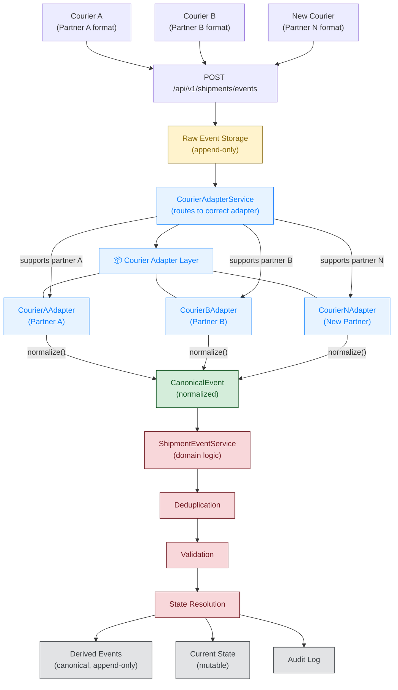

# Interview Questions

## What was underspecified in brief?

The requirements described the problem space clearly but left many implementation decisions open. The table below shows the most consequential gaps and how they were resolved.

| Underspecified Item | Resolution |
|---------------------|-----------|
| **Deduplication key** | FR-2 says "per-partner" but doesn't name the composite key | ADR-003: `(partner, eventId)` as the deduplication key |
| **Authoritative ordering timestamp** | FR-3 says use `occurredAt` but acknowledges it's unreliable | ADR-001: use `receivedAt` as the authoritative ordering signal; `occurredAt` stored for audit only |
| **Out-of-order events — what happens to older events?** | FR-3 says "use `occurredAt`" but doesn't specify what happens when older events arrive | Events with older `receivedAt` than current state are stored but **do not update current state** — history preserved |
| **Conflict resolution mechanism** | FR-4 says "deterministic rules engine" but doesn't define the interface | `ShipmentStateResolver` pluggable interface; default resolver applies deterministic rule chain |
| **Batch vs single-event processing** | FR mentions "courier events arrive" but not batch semantics | ADR-005: per-event isolation — each event processed independently, one bad event doesn't poison the batch |
| **API endpoint shapes** | FR-1 to FR-7 describe capabilities but no endpoints specified | Webhook: `POST /api/v1/shipments/events`; Query: `GET /api/v1/shipments/{shipmentId}/status` |
| **Database technology** | NFR-4: hosting/stack not prescribed | SQLite with Spring Data JPA / Hibernate |
| **Runtime port** | Not specified | Port `8080` |
| **Invalid transition handling** | FR-5 says invalid transitions are "rejected" | Invalid transitions are persisted but marked `rejected` in audit trail |
| **Terminal state behaviour** | FR-4 and FR-5 imply terminal states block further updates | `DELIVERED` and `RETURNED` are terminal — all incoming events rejected, no further transitions allowed |
| **Retention policy** | Not mentioned in requirements | ADR-006: 30-day raw events, 1-year audit log; terminal-state shipments retained indefinitely |
| **Release/CI pipeline** | Out of scope per OVERVIEW | Split into `ci.yml` (dev push → tests → auto-PR) and `release.yml` (main push → tests → `release:prepare` tag) |
| **Code review before merge** | Not specified | Branch protection on `main` requires PR review before merge |
| **Auto-merge or manual** | Not specified | Manual merge after review — no auto-merge |

---

## Why is event storage split into raw_events, derived_events, and audit_log?

The split exists to serve two masters simultaneously: **legal compliance** and **correct system behaviour**.

**Raw events** — the partner's exact payload, kept for 30 days. This is a legal requirement. If a dispute arises, the client must be able to show what the courier actually sent. After 30 days it is deleted unless the shipment is in a terminal state.

**Derived events** — normalised canonical events that passed deduplication and validation. Kept indefinitely. This is the clean record the system actually uses. Every decision traces back to a derived event.

**Audit log** — one row per resolution decision (accepted, rejected, duplicate, out-of-order), kept for one year. Also legal. Even after raw events are deleted, every decision the system made is explainable.

**Current state** — one row per shipment, updated only when a valid newer event arrives. This is what queries hit. It is always derivable from the derived event store, but stored separately for query performance.

The separation means:

- Legal retention is satisfied by independent cleanup jobs on raw events and audit log
- Correctness is maintained because the derived event store is the primary processing path and is never purged
- Debugging is possible even after raw events expire, because the audit log records the reasoning

The alternative — one big event store with everything — would make retention policy harder to implement correctly and would mix the partner's raw payload format with the normalised canonical record longer than necessary.

---

## The `receivedAt` bug — how it slipped through and what it reveals

**What happened.** Phase 1 was scoped to Partner A only. Using `occurredAt` was a reasonable default for Partner A's known behaviour. The client's Q&A flagged that `occurredAt` is unreliable — but that flag was theoretical at that stage, since Partner B didn't exist yet. When the mandatory change request introduced Partner B with frequent out-of-order events, the `occurredAt` assumption became actively wrong. ADR-001 was updated to specify `receivedAt` as authoritative, anticipating Partner B's needs. But the resolver code was not updated at the same time. The architecture doc reflected the new decision; the code still operated on the old logic.

**How it slipped through tests.** The test data sets both timestamps to the same value in every test case. With both timestamps identical, the tests verified that the comparison logic works — older events don't update state, newer events do — but they did not distinguish which timestamp the resolver was actually checking. The code under test could have been comparing either one and the tests would have passed. That is exactly what happened.

A test with divergent timestamps would have caught this immediately:

```java
// Current state: IN_TRANSIT, receivedAt = 12:00, occurredAt = 11:00
// Incoming: OUT_FOR_DELIVERY, receivedAt = 11:30, occurredAt = 12:30
// receivedAt is older → should NOT update state
```

No such test existed.

**What process should have caught it.** The gap between ADR and code is the real issue. When ADR-001 was updated, no one went back to check whether existing code matched the updated ADR. In a proper process: a PR that touches an ADR should trigger a review of all code implementing that ADR, and a code review for resolver logic should explicitly check whether any applicable ADRs exist and whether the code matches them. I would also introduce an "implemented by" field in each ADR linking to the relevant code — so a doc change prompts a review of the linked code, and a code review checks whether the linked ADR is current.

**What AI's role was.** AI generated the initial resolver from a prompt that described the transition rules correctly but did not specify which timestamp to use. The prompt followed the brief literally. The Q&A context about timestamp unreliability existed in a separate document — it was not in the prompt sent to AI. AI cannot cross-reference documents it wasn't given.

**If it had shipped.** The event store is append-only, so for any affected shipment we can replay events in correct `receivedAt` order and recompute state. The resolution logic is deterministic — same inputs always produce the same output. The fix is: correct the resolver, then run a replay job for affected shipments. No data is lost. In production, a metric — count of events rejected as out-of-order per partner per day — would have flagged an unexpectedly high rate for Partner B.

---

## Deduplication: code check vs database constraint

Both layers exist, and they serve different purposes.

**Code check:** `rawEventRepository.existsByEventIdAndPartner(eventId, partner)` runs first. It returns a structured `DUPLICATE` response with a reason string and logs the detection. This is the API contract — the caller gets a meaningful error, not a database exception.

**Database constraint:** `UniqueConstraint(columnNames = {"event_id", "partner"})` on `raw_events` enforces the same rule at the storage layer. This is the integrity backstop. If the code check has a bug — or if something bypasses the code path and writes directly — the database throws a constraint violation rather than silently accepting a duplicate.

The division of responsibility: code handles the API contract (structured response, logging, caller-facing error). The database provides the integrity guarantee (nothing slips through even if code is wrong).

**If the code check passes but the constraint fails.** This should not happen in normal operation — if `existsByEventIdAndPartner` returns false, the unique constraint should not be violated on insert. If it does, it indicates a concurrent write (two threads processing the same event simultaneously) or a bug in the code path. The database constraint is the safety net; the constraint violation propagates as an exception rather than a silent duplicate. In production, this scenario should be rare enough to investigate individually rather than handle as an expected case.

---

## Terminal states — what happens when a correction is needed?

`DELIVERED` and `RETURNED` are terminal. No incoming event can change them. If a courier later sends an event saying the shipment went back into transit, it is recorded in the audit log and rejected.

If a human needs to correct a terminal state — the shipment was delivered to the wrong address — the current system has no first-class correction mechanism. Two options exist today:

1. **Manual database update.** An operator with direct database access updates `shipment_current_state` and records the correction in the audit log. This works but bypasses the event processing path and the audit trail does not automatically capture it as a correction event.

2. **Special correction event type.** A new event type `CORRECTED` or `DELIVERY_ADDRESS_AMENDED` is introduced. This would flow through the normal processing path, create an audit entry, and update current state. It requires a code change and a definition of what transitions are allowed from a terminal state.

Without a defined process, engineers will make ad hoc fixes that bypass the audit trail. For a production system, the correction workflow is a real requirement that needs explicit design before go-live.

---

## How would the architecture change if a correction event type was implemented?

A correction is not a normal shipment event. It says "the last state we recorded was incorrect, here is what it should actually be." It needs to exit a terminal state — something the current state machine cannot do.

### The core architectural question: terminal or amendable?

If `DELIVERED → CORRECTION → IN_TRANSIT` is allowed, then `DELIVERED` was never truly terminal. The terminal state was a simplification. Corrections expose that the domain has a correction path the original state machine did not model.

This means one of two approaches:

**Option A: Corrections are a separate mechanism**

Corrections bypass the normal state machine rules entirely. The resolver has special logic — if the incoming event is a correction, allow it regardless of the current state's transitions map.

```java
if (event.isCorrection()) {
    return ShipmentResolutionResult.acceptedCorrection(event, currentState);
}
```

The state machine remains unchanged. Corrections are not events in the state machine — they are administrative overrides with their own processing path.

**Option B: Corrections extend the state machine**

`DELIVERED` and `RETURNED` are no longer terminal. New transitions are added:

```
DELIVERED → DELIVERY_ADDRESS_AMENDED
DELIVERED → DELIVERY_REVERSED
RETURNED → RETURN_REVERSED → IN_TRANSIT
```

The state machine now has an explicit correction path. This is more transparent but requires changing the state machine definition for every new correction type.

### What changes in the architecture

**New event type and status value.**

```java
public enum ShipmentEventType {
    NORMAL,
    CORRECTION
}

public enum ShipmentStatus {
    // existing statuses...
    DELIVERY_ADDRESS_AMENDED,
    DELIVERY_REVERSED,
    RETURN_REVERSED,
}
```

The event entity gets a new field:

```java
@Enumerated(EnumType.STRING)
private ShipmentEventType eventType = ShipmentEventType.NORMAL;
```

**Resolver branches on event type.**

```java
public ShipmentResolutionResult resolve(ShipmentEventEntity incoming,
                                        ShipmentCurrentStateEntity current) {
    if (incoming.getEventType() == ShipmentEventType.CORRECTION) {
        return resolveCorrection(incoming, current);
    }

    // existing transition logic
    if (current.getStatus().isTerminal()) {
        return ShipmentResolutionResult.rejected("TERMINAL_STATE_NO_TRANSITIONS_ALLOWED");
    }
    // ...
}

private ShipmentResolutionResult resolveCorrection(ShipmentEventEntity incoming,
                                                   ShipmentCurrentStateEntity current) {
    // Allow correction from terminal states
    // Validate: is this correction type allowed for this status?
    // Validate: is the corrector authorised?
    return ShipmentResolutionResult.corrected(incoming.getCorrectedStatus(),
                                              incoming.getCorrectionReason());
}
```

**Authorization — who can send corrections?**

The current webhook is open — any event with a valid `(eventId, partner)` is processed. A correction needs different authentication. Options:

- **Separate admin endpoint.** A dedicated `POST /admin/corrections` endpoint that requires authentication, rather than mixing corrections with normal event ingestion. Cleanest separation.
- **Role-based flag on the event.** A `requires_human_approval` flag. If set, the event is stored but not applied — it sits in a pending corrections queue for manual review.
- **Correction partner type.** A courier partner with `type=CORRECTION` can send corrections. All other partners send normal events only.

The admin endpoint approach is cleanest — it separates the business event path from the administrative correction path, and authentication lives at the HTTP layer.

**Audit trail captures before and after.**

Normal events log: `(eventId, shipmentId, partner, previousStatus, newStatus, decision)`.

Corrections need more:

```java
AuditLogEntry {
    eventId,
    shipmentId,
    partner,
    eventType: CORRECTION,
    previousStatus,       // what was wrong
    correctedStatus,      // what it is now
    correctionReason,    // "address amended", "wrong recipient"
    authorisedBy,        // operator ID, system ID — never anonymous
    approvedAt,          // timestamp of authorisation
}
```

The `authorisedBy` field is critical — corrections should never happen anonymously.

**Chaining corrections.**

Can you correct a correction? If the corrected address was itself wrong, can another correction come in?

The system should allow it — each correction is logged independently, and the chain of `previousStatus → correctedStatus` forms an auditable history. `RETURNED → RETURN_REVERSED → IN_TRANSIT` follows normal transitions from `RETURN_REVERSED` onward. `RETURN_REVERSED` is not terminal — it is a corrected state that continues through the normal lifecycle.

**Terminal states no longer exist.**

Once corrections are allowed, no state is truly terminal. `DELIVERED` means "the normal delivery process completed, unless someone corrects it." The state machine becomes a record of what happened, not a forced path to an end state. `DELIVERED` and `RETURNED` are terminal in the normal path — but the correction path can restart the journey.

### Summary of changes

| Concern | Current | With corrections |
|---------|---------|-----------------|
| Terminal states | Final — no outgoing transitions | Corrections can exit them |
| Event type field | Not needed | Added to entity and DTO |
| Resolver logic | Single path | Branches on `eventType` |
| Authorization | None (open webhook) | Admin endpoint or approval workflow |
| Audit trail | Standard event logging | Enhanced with `authorisedBy`, `correctionReason` |
| State machine | `DELIVERED` and `RETURNED` are sinks | New `*_REVERSED` / `*_AMENDED` states as correction exits |
| Query API | Event history shows transitions | Must surface correction chain and reasons |

---

## How would a separate correction ingestion point with authorization work?

A separate correction endpoint with its own authorization is the cleaner approach — it keeps administrative overrides away from the normal event path.

```
POST /api/v1/admin/shipments/{shipmentId}/correction
Authorization: Bearer <operator-token>

{
  "correctedStatus": "IN_TRANSIT",
  "reason": "wrong_address",
  "note": "Customer called to report incorrect delivery address"
}
```

The normal event webhook stays open — `POST /api/v1/shipments/events` — and requires no authentication. The correction endpoint requires a valid operator token. Different concerns, different paths.

### Do corrections use the state machine?

No — corrections are not state transitions. They are state overrides.

The state machine encodes rules for how a shipment moves based on courier events. A correction says "set the state to X regardless of what the state machine says." It bypasses `ALLOWED_TRANSITIONS` entirely.

The correction resolver looks nothing like the normal resolver:

```java
public CorrectionResult applyCorrection(String shipmentId,
                                       CorrectionRequest request,
                                       Operator operator) {
    ShipmentCurrentStateEntity current = currentStateRepository.findById(shipmentId)
            .orElseThrow(() -> new ShipmentNotFoundException(shipmentId));

    // No transition check. No state machine. Just validation.

    if (!operator.canCorrectTo(request.getCorrectedStatus())) {
        return CorrectionResult.unauthorised(operator, request.getCorrectedStatus());
    }

    ShipmentStatus previousStatus = current.getCurrentStatus();

    current.setCurrentStatus(request.getCorrectedStatus());
    current.setLastReceivedAt(Instant.now());
    currentStateRepository.save(current);

    auditLogRepository.save(CorrectionAuditEntry.builder()
            .shipmentId(shipmentId)
            .eventType(EventType.CORRECTION)
            .previousStatus(previousStatus)
            .newStatus(request.getCorrectedStatus())
            .correctionReason(request.getReason())
            .authorisedBy(operator.getId())
            .approvedAt(Instant.now())
            .note(request.getNote())
            .build());

    return CorrectionResult.success(previousStatus, request.getCorrectedStatus());
}
```

The state machine is never consulted. The correction is a direct write to `current_state`.

### Can you still use the audit functionality?

Yes — the existing audit infrastructure is general enough to accommodate corrections with minimal extension.

The current audit log entity captures:

```java
eventId,
shipmentId,
partner,
previousStatus,
newStatus,
decision,        // ACCEPTED, REJECTED, NO_UPDATE
rejectionReason,
receivedAt
```

For corrections, add fields:

```java
eventType,       // NORMAL | CORRECTION
authorisedBy,    // operator ID — who approved the correction
correctionReason // "wrong_address" | "return_to_sender" | etc
```

The existing audit log table handles both event types. A correction is a row with `eventType=CORRECTION` and extra fields populated. The `decision` column can be repurposed — `CORRECTED` instead of `ACCEPTED` — making it clear this was an administrative action.

This means:

- **The same audit log query API works for corrections** — filter by `eventType=CORRECTION` to see all corrections for a shipment
- **The same retention policy applies** — corrections are retained per the same schedule as normal audit entries
- **No new audit infrastructure needed** — the correction path writes to the same table, enriched

### Authorization lives at the endpoint

The correction endpoint is the right place for authorization because it is HTTP-layer enforcement, not application logic:

- The operator presents a JWT or API token in the `Authorization` header
- The endpoint validates the token and extracts the operator identity and roles
- The application checks `operator.canCorrectTo(status)` against a permissions table

No token, no correction. No elevated role, no correction to certain states. An operator might be allowed to correct `DELIVERED → IN_TRANSIT` but not `DELIVERED → RETURNED`. The permissions matrix is per-operator and per-target-state.

### Does the correction endpoint write to raw_events?

No — the raw event store is for courier events as-received. A correction is not a courier event. Writing it to `raw_events` would mix administrative overrides with partner events and complicate the event history.

Corrections write only to `current_state` (to apply the new state) and `audit_log` (to record what happened and why). The `derived_events` table is also unaffected — corrections do not create canonical events in the event history. The event history shows what the courier reported; corrections are administrative overlays on top of that history.

### Summary

| Concern | Design |
|---------|--------|
| Separate endpoint | `POST /admin/corrections` with auth, normal webhook unchanged |
| State machine | Not used — corrections are direct state overrides |
| Target validation | Must be a valid `ShipmentStatus` value |
| Authorization | Operator token validated at HTTP layer, permissions matrix per-state |
| Audit functionality | Same audit log table, same retention policy, same query API — enriched with `eventType`, `authorisedBy`, `correctionReason` |
| Raw events | Not written — corrections are not courier events |
| Derived events | Not written — corrections do not appear in event history |

---

## Grace window for Partner B — implemented or not?

No — the grace window is a Phase 2 workstream, not implemented in the current codebase.

The system handles out-of-order events by comparing `receivedAt` timestamps: if an event's `receivedAt` is older than the current state's last `receivedAt`, the event is recorded but does not update current state. This is a hard rule — no waiting, no hold.

### How the grace window actually works

The grace window introduces a pending buffer for out-of-order events. Instead of immediately rejecting, the system holds the event briefly and waits to see if the missing older event arrives.

```
Event arrives: OUT_FOR_DELIVERY, receivedAt = 12:00
Current state: IN_TRANSIT, lastReceivedAt = 12:05
→ receivedAt is older → hold event in pending buffer for 5 minutes

[4 minutes later]
Older event arrives: IN_TRANSIT, receivedAt = 12:00
→ This event IS in order relative to the held event
→ Release held OUT_FOR_DELIVERY from buffer
→ IN_TRANSIT(12:00) → OUT_FOR_DELIVERY(12:00) = valid transition → apply
```

**The pending buffer** holds events that are waiting:

```java
PendingEvent {
    eventId,
    shipmentId,
    receivedAt,
    occurredAt,
    status,
    heldAt,           // when the hold started
    releaseAt,        // heldAt + graceWindow
    stateBeforeHold   // current_state at time of hold
}
```

**Three outcomes for a held event:**

1. **The older event arrives in time** — release and apply. The held event's `receivedAt` is now valid relative to the newly arrived older event. Process normally: check transition, update state, write audit log with `CORRECTED_AFTER_GRACE`.

2. **The grace window closes without the older event arriving** — release and reject. The held event's `receivedAt` remains older than the current state's. Audit log marks it as `REJECTED_GRACE_WINDOW_EXPIRED`.

3. **A newer event arrives that supersedes the held event** — cancel the hold. If while an event is held, a newer event arrives that would update the current state past the held event's position, the held event is released and rejected as `SUPERSEDED_BY_NEWER_EVENT`.

**What the grace window does not change:**

- Events are still stored in `raw_events` and `derived_events` regardless of hold status
- The event store is still the source of truth
- The deduplication check still runs at arrival time, before the hold decision

**The stale state problem.** During the hold window, `current_state` is unchanged. A status query returns the old state even though the system already knows about a newer event that is waiting. This is a trade-off: accepting slightly stale queries in exchange for not prematurely rejecting events that may yet prove valid. Internal logistics dashboards may tolerate this; customer-facing tracking likely would not.

**Choosing the window duration.** The correct duration depends on Partner B's observed out-of-order frequency. Too short: events are rejected before the missing older event had a chance to arrive. Too long: state is stale for an unacceptable window. Start with a conservative guess (5 minutes), log borderline cases, and calibrate after a week of live Partner B traffic. The window can be tuned per partner.

### How corrections interact with the grace window

Once corrections exist, the grace window gains a new complexity: held events and corrections interact.

**The problem.** While an event is held in the grace buffer, an authorized operator might send a correction for the same shipment. The correction writes directly to `current_state` and bypasses the grace window. But the held event still exists in the pending buffer and will be released when its grace window closes.

```
current_state: IN_TRANSIT (lastReceivedAt = 12:00)

Event A arrives at 12:05: OUT_FOR_DELIVERY, receivedAt = 12:01
→ held in grace buffer

Operator sends correction at 12:06: target = IN_TRANSIT
→ current_state now: IN_TRANSIT (lastReceivedAt = 12:06)

Grace window for Event A closes at 12:10
→ Release held event: OUT_FOR_DELIVERY, receivedAt = 12:01
→ IN_TRANSIT → OUT_FOR_DELIVERY: valid transition
→ Apply: current_state = OUT_FOR_DELIVERY
```

The correction was overwritten by the held event that had been waiting since before the correction was applied. The operator's correction was correct at the time, but the system's eventual state does not reflect it.

**Option A: Corrections invalidate held events.** When a correction is applied, immediately release all held events for that shipment as `SUPERSEDED_BY_CORRECTION`. The correction always wins. Simple, predictable.

```java
void applyCorrection(String shipmentId, CorrectionRequest request) {
    currentStateRepository.update(shipmentId, request.getCorrectedStatus());
    pendingEventRepository.releaseAllForShipment(shipmentId, Decision.SUPERSEDED_BY_CORRECTION);
    auditLogRepository.writeCorrection(...);
}
```

**Option B: Held events block corrections until released.** When a correction arrives, check if any events for that shipment are currently held. Wait until the grace window closes and all held events are resolved before applying the correction. More complex — corrections become dependent on the grace window state.

**Which to choose.** Option A is simplest and most predictable. Corrections are administrative actions taken with full knowledge of current state. Held events are unconfirmed courier reports. The correction should always win.

### Summary

| Concern | Without corrections | With corrections |
|---------|---------------------|-------------------|
| Held event vs newer event | Grace window applies | Same — compared against current state at release |
| Held event vs older event | Validated and applied or rejected | Same |
| Correction arrives while event is held | No interaction | Correction writes to current_state immediately |
| Held event release after correction | N/A | Must decide: correction wins or held event can overwrite it |
| Recommended | N/A | Option A — corrections invalidate held events |

---

## SQLite vs PostgreSQL — when to migrate and how?

**When.** SQLite serialises writes — one writer at a time. For a single courier partner's event volume, this is fine. The trigger is write throughput: roughly 500–1000 writes per second on a modest instance, depending on hardware. Multiple courier partners sending high-volume batches will hit this ceiling faster. The migration should be triggered by an explicit threshold agreed with the client (e.g., events-per-day) rather than discovered under pressure.

**How.** The architecture isolates persistence — all database access goes through repositories. The migration is:
1. Introduce PostgreSQL alongside SQLite with a feature flag
2. Run both in parallel, comparing results
3. Cut over write path to PostgreSQL
4. Migrate existing SQLite data via a migration job
5. Remove SQLite

The schema is not complex — `raw_events`, `derived_events`, `audit_log`, `shipment_current_state`. A Flyway or Liquibase migration script handles the schema creation cleanly.

**What changes.** Connection pool configuration (HikariCP), dialect (`SQLiteDialect` → `PostgreSQLDialect`), and any raw SQL that relies on SQLite-specific functions. The repository interfaces stay the same.

---

## Why not Kafka?

Kafka would be reasonable at production scale with multiple consumers. It was not chosen because:

**The brief didn't ask for it.** The problem is a webhook receiving events and producing a queryable current state. Kafka solves distributed log semantics, multiple independent consumers, and event replay — none of which were in scope.

**Scope control.** Kafka adds cluster management, topic configuration, consumer groups, offset management, dead letter queues, consumer lag monitoring, and partitioning strategy. That is significant infrastructure complexity for a thin slice that needs to demonstrate core business logic first.

**Single consumer.** Kafka's strength is multiple independent consumers processing the same stream differently. Here there is one authoritative service consuming one webhook — no distributed log needed.

**Lightweight intent.** SQLite was chosen deliberately — zero configuration, easy to run, appropriate for a demonstration. The architecture document explicitly notes that Kafka makes sense when: multiple downstream systems consume events in different ways, genuine async processing with replay is required, or volume demands partitioning.

**The honest answer.** If an interviewer pushes back on this, the answer is: "You're right that Kafka would be appropriate at the scale where multiple consumers need independent views of the event stream. We were not at that scale. If the system evolves to that point, Kafka is the right migration target."

---

## Append-only store with mutable current state — why not compute on every query?

Two reasons: **latency** and **correctness under load**.

**Latency.** A shipment could accumulate hundreds of events over its lifetime. Replaying the full event history on every status query would mean scanning potentially hundreds of rows per query. With the derived current state stored separately, status queries are a single-row lookup — O(1) regardless of event history length.

**Correctness under load.** If the event store and current state ever diverge — due to a crash, bug, or race condition — the system can replay events from the append-only store and recompute correct state. The append-only store is the source of truth for recomputation; current state is a derived cache that can be rebuilt.

**The risk.** Current state is updated after the event is written. If the service crashes mid-processing — event written to `derived_events` but `current_state` not yet updated — the event is persisted but the shipment shows stale state until the next event arrives and triggers a recomputation. There is no automated repair job. The recovery path is manual replay or waiting for the next event.

The alternative (compute on every query) would eliminate the drift risk but add query latency proportional to event history length, which is worse for the common case — most queries are for current status, not historical replay.

---

## Crash during processing — event written but state not updated

After the change request, the processing path is:

1. Write to `raw_events`
2. Deduplication check against `raw_events`
3. Write to `derived_events`
4. Apply resolution rules
5. Update `current_state` if the event was accepted
6. Write audit log entry

If the service crashes between steps 3 and 5: the event is in `derived_events` but `current_state` has not been updated. On restart, the event is persisted but the shipment shows the wrong state.

The recovery path is: when the next event for that shipment arrives, the resolver loads the current state, sees the stale value, compares it against the persisted event's `receivedAt`, and — if the next event's `receivedAt` is newer than the stale current state — applies a state transition. But if the next event is for a different shipment, or if no further events arrive, the stale state persists indefinitely.

The append-only event store is the resilience primitive — replaying events in `receivedAt` order always produces correct state. But there is no scheduled replay job that detects and corrects state drift after a crash. This is a known gap for production hardening.

---

## Permissive state machine — why not require LABEL_CREATED first and every intermediate state?

Two deliberate design choices:

**First event is not required to be LABEL_CREATED.** Courier partners don't always send the label creation event. If the first event received is `IN_TRANSIT`, it is accepted as valid. Enforcing `LABEL_CREATED` as mandatory first would block legitimate shipments from being tracked. The system accepts any valid first event as the initial state.

**Intermediate states are not required.** A shipment can skip states as long as the path is valid. `LABEL_CREATED → IN_TRANSIT` is permitted even if `HANDED_TO_CARRIER` was never sent. The system does not infer missing states — it simply accepts that the current state is whatever the most recent valid event says it is.

Strict enforcement — requiring every intermediate state in order — would detect gaps but would reject valid shipments that genuinely skip steps due to partner behaviour. The design chose permissive forward progression over strict completeness.

The tradeoff is visible: a gap in the event history might mean the partner skipped a step, or it might mean an event was lost. The permissive design accepts this ambiguity and does not try to guess.

---

## What invariants does the permissive state machine actually enforce?

Two deliberate design choices:

**First event is not required to be LABEL_CREATED.** Courier partners don't always send the label creation event. If the first event received is `IN_TRANSIT`, it is accepted as valid. Enforcing `LABEL_CREATED` as mandatory first would block legitimate shipments from being tracked. The system accepts any valid first event as the initial state.

**Intermediate states are not required.** A shipment can skip states as long as the path is valid. `LABEL_CREATED → IN_TRANSIT` is permitted even if `HANDED_TO_CARRIER` was never sent. The system does not infer missing states — it simply accepts that the current state is whatever the most recent valid event says it is.

Strict enforcement — requiring every intermediate state in order — would detect gaps but would reject valid shipments that genuinely skip steps due to partner behaviour. The design chose permissive forward progression over strict completeness. The tradeoff is visible: a gap in the event history might mean the partner skipped a step, or it might mean an event was lost. The permissive design accepts this ambiguity and does not try to guess.

**Yes — it is still an invariant system, but it is a different kind of invariant than the strict "step-by-step workflow" people usually assume.**

The shift is from **process completeness invariant** to **state validity invariant**.

### What invariant was removed vs what was kept

**Removed:** "No skipped states allowed."

That would look like `LABEL_CREATED → HANDED_TO_CARRIER → IN_TRANSIT → OUT_FOR_DELIVERY` where every intermediate step must exist. The system does NOT enforce this.

**Kept:** Only valid transitions are allowed between observed states. Formally: `nextState ∈ ALLOWED_TRANSITIONS[currentState]`. For a first event (no current state), any valid state is accepted as the initial state.

### So is it still an invariant?

Yes — but a weaker, more realistic one. The core invariant holds:

> A shipment must never enter an invalid state or perform an invalid transition.
>
> `nextState ∈ ALLOWED_TRANSITIONS[currentState]`
>
> OR for a first event: `currentState = null → any valid state is allowed`

### What changed is not invariance — it is completeness assumptions

The system no longer assumes it knows the full lifecycle. It now trusts only observed truth.

| Model | Meaning | Applied here |
|-------|---------|--------------|
| Strict workflow model | Enforces every step | ❌ Not used |
| Event reality model | Accepts partial truth | ✅ Used |

### The real invariant: observed state consistency

The system state must always reflect the last known valid event, and that state must be reachable via a valid transition from the previous state (if one exists).

### Why skipping states does NOT break invariants

The system allows `LABEL_CREATED → IN_TRANSIT` even though `HANDED_TO_CARRIER` is missing.

This is still valid because the invariant does not say "all intermediate nodes must exist." It says: "if a node exists, it must be a valid node in the state machine, and transitions must be valid."

The system moved from **process correctness** (rigid workflow) to **domain truth correctness** (event-driven reality).

There are now two different correctness dimensions:

**Structural invariant** (still enforced):
- Valid states
- Valid transitions
- No impossible state values

**Temporal completeness** (not enforced):
- No guarantee of full journey
- No guarantee of missing events
- No enforced sequence completeness

---

## Courier adapter layer — normalizing heterogeneous event formats

Every courier has their own event schema. A new courier might send:

```json
{
  "tracking_number": "PKG123",
  "status_code": "IT",
  "timestamp": "2024-01-15T10:30:00Z"
}
```

Another sends:

```json
{
  "shipmentId": "PKG123",
  "state": "IN_TRANSIT",
  "eventTime": "2024-01-15T10:30:00Z",
  "location": { "city": "Berlin", "country": "DE" }
}
```

Both represent the same event. The system needs a canonical internal format that all couriers are normalized to.

### Approach: adapter per courier at the ingestion boundary

```
Courier A → CourierAAdapter → CanonicalEvent → Service
Courier B → CourierBAdapter → CanonicalEvent → Service
Courier C → CourierCAdapter → CanonicalEvent → Service
```

**Raw event** stores the original JSON as-is — no transformation, no loss. This is the audit trail. **Derived event** stores the normalized canonical form. The adapter is the only place that knows about courier-specific field names, status strings, and nesting. The core service is courier-agnostic.

### Where the adapter layer sits

```
Webhook → [Raw Event Storage] → [Courier Adapter] → [Core Service Logic] → ...
```

The order matters:

1. **Webhook receives raw JSON** — completely agnostic, no parsing
2. **Raw event stored immediately** — canonical audit trail, no parsing required
3. **Courier adapter normalizes** — converts courier-specific format to canonical event
4. **Core service receives only canonical format** — never knows about courier-specific quirks

Not inside the webhook — that would couple courier knowledge to the HTTP boundary. Not inside the existing `ShipmentEventService` — that would mix courier-specific parsing with domain logic. The adapter is an infrastructure concern; the service is the domain. Keep them separate.

### What changes when a new courier arrives

1. Register a new adapter implementing `CourierEventAdapter.normalize(rawPayload, partner) → CanonicalEvent`
2. Map courier-specific status strings to canonical status values (`"IT"` → `IN_TRANSIT`)
3. Handle structural differences — timestamps in different formats, nested vs flat location, optional fields
4. Add integration tests — replay real events from the new courier through the adapter

### What the code would look like

```java
public interface CourierEventAdapter {
    CanonicalEvent normalize(String rawPayload, String partner);
    boolean supports(String partner);
}

@Service
@RequiredArgsConstructor
public class CourierAdapterService {
    private final Map<String, CourierEventAdapter> adapters;

    public CanonicalEvent adapt(RawEventEntity raw) {
        CourierEventAdapter adapter = adapters.get(raw.getPartner());
        if (adapter == null) {
            throw new UnsupportedPartnerException(raw.getPartner());
        }
        return adapter.normalize(raw.getPayload(), raw.getPartner());
    }
}
```

### The canonical boundary

The **raw event is the boundary of trust**. Everything before it — the webhook, the initial storage — must handle any courier format without failing. Everything after it — normalization, validation, resolution — works only with the canonical model.

If normalization fails, the raw event is already stored. The failure is recorded in the audit log. The shipment does not update. The courier's retry will work because the raw event is there for deduplication to catch.

### Practical risk: status code mapping

Status code mapping is a maintenance burden. Each courier has their own vocabulary and they change it without notice. A status like `"DELAYED"` might mean `IN_TRANSIT` for one courier and `DELIVERY_EXCEPTION` for another. The mapping table needs to be observable and tested — a change to a mapping can silently change shipment state for hundreds of events.

### Architecture diagram



Three zones:

| Zone | What lives here | Changes when |
|------|-----------------|--------------|
| Courier-specific | Webhook, raw storage | New courier format arrives |
| Adapter layer | Per-courier adapters, routing | New courier added |
| Canonical / Domain | Core service, all domain logic | Business rules change |

The **canonical boundary** is the key insight — everything left of `CanonicalEvent` knows about courier formats, everything right of it is courier-agnostic. The adapter layer is the translation wall.

### Why not a schema registry?

Schema registries (Confluent, AWS Glue) make sense when you have many producers and consumers sharing a common event bus. For a single service with a handful of courier integrations, per-courier adapters with a shared canonical model are lighter and easier to reason about. The registry adds operational overhead — schema evolution, compatibility checks, version management — that is not justified at this scale.

---

## Could you enforce a single input event structure through OpenAPI instead?

No, not in practice. OpenAPI enforces the contract at the API boundary, but it cannot force a courier who has their own logistics platform to rewrite their system. If you have dozens of courier integrations, you cannot call up DHL or FedEx and ask them to change their webhook format to match your spec. They have their own API contracts built over years, integrated with hundreds of other clients. You are not the centre of their universe.

Even with a new courier you are onboarding, if they have an existing integration with other clients, they will not change their format for one new partner. The cost is theirs; the benefit is yours.

### What OpenAPI actually solves

OpenAPI is useful for:

- **Internal services** — you control the codebase, you can enforce the schema
- **New couriers you are onboarding from scratch** — you can make the OpenAPI spec a requirement of partnership
- **Client-facing APIs** — your customers, not your integration partners, consume these

OpenAPI does not solve:

- **Existing courier integrations** — their systems predate yours
- **Asymmetric leverage** — a small logistics startup might comply, a global carrier will not
- **Format translation** — a valid JSON payload can still have wrong status strings, wrong timestamp formats, wrong field names

### Where OpenAPI fits in this design

OpenAPI is the right tool for documenting and validating the canonical input format — once you have defined it. The adapters translate from courier-specific formats to the canonical format; OpenAPI validates that the canonical format is correct before it enters the core service.

```
Courier → Webhook (OpenAPI validates canonical schema) → Adapter normalizes → Core service
```

OpenAPI enforces that the **internal** format is correct. The adapter handles the translation from each courier's external format to that internal format.

### The actual business constraint

In logistics integrations, you almost never dictate terms to couriers. They are established players with their own APIs, and you integrate with theirs. The adapter pattern exists precisely because you cannot make them conform to your schema. If a courier is small and eager for your business, you can require OpenAPI compliance and skip the adapter. But that is the exception, not the rule. The adapter layer is the general solution because it decouples your system from courier-specific formats entirely, regardless of whether the courier is willing to change.

The pragmatic answer: enforcing a single input structure through OpenAPI is the right approach when you have the leverage to dictate terms. In this system, the adapter layer exists because we assumed we would not always have that leverage. OpenAPI would then validate the canonical format our own system uses internally, not the external formats we receive.

---

## What happens if a batch partner sends a spreadsheet instead of JSON?

At the webhook, the request arrives with `Content-Type: application/json`. If the partner sends a CSV or XLSX file instead, Spring cannot parse it as JSON — the request body deserialization fails before it ever reaches your code.

**What breaks immediately.** The webhook fails with a 400 Bad Request. The controller expects `BatchEventRequest` which Spring deserializes from JSON. A CSV body throws `HttpMessageNotReadableException` — no events processed, nothing stored. The partner sees 400, not a more informative error code. If they do not retry with correct format, the event is lost.

**Why the raw event is missing.** The current design stores the raw event inside the service, after Spring has already deserialized the request body. If Spring's deserialization fails, `receiveEvent` is never called. The raw event should be the first write, before parsing — but in the current design it is the second step.

```
Current:  Webhook → [Spring deserializes JSON] → Service → RawStorage
Gap:      Failure before raw storage means no audit trail for malformed requests
```

**What would need to change.** Accept multiple content types at the webhook. The endpoint would need to inspect the `Content-Type` header and route to the appropriate parser.

```
Content-Type: application/json  → JSON parser → BatchEventRequest
Content-Type: text/csv         → CSV parser   → BatchEventRequest
Content-Type: application/vnd.openxmlformats → Excel parser → BatchEventRequest
```

Store raw before parsing. Move raw storage to before any deserialization — store the raw bytes immediately, then attempt to parse. If parsing fails, the raw event is already stored and can be recovered or replayed.

```java
@PostMapping
public ResponseEntity<?> receiveBatchEvents(
        @RequestBody String rawPayload,
        @RequestHeader("Content-Type") String contentType) {

    // Store raw FIRST — before parsing
    RawEventEntity raw = rawEventRepository.save(RawEventEntity.builder()
            .partner(determinePartnerFromHeaders())
            .payload(rawPayload)
            .receivedAt(Instant.now())
            .build());

    // Then try to parse
    try {
        BatchEventRequest request = parse(rawPayload, contentType);
        return ok(adapterService.processBatch(request));
    } catch (ParseException e) {
        return ResponseEntity.badRequest()
                .body("Could not parse payload as " + contentType);
    }
}
```

**The real question: does this belong in the system?** CSV and Excel uploads are typically human-initiated — someone downloads a report from a courier portal and uploads it manually. This is a different interaction model from a webhook, which is machine-to-machine and event-driven.

If a courier partner genuinely cannot send JSON via webhook, the options are:

1. **File-based integration** — they upload a CSV to an SFTP endpoint or cloud storage. A separate job picks it up and processes it. This keeps the webhook path clean for real-time events.

2. **API gateway transformation** — an API gateway handles content-type negotiation and basic parsing before requests reach the service.

3. **Ingestion service handles it** — add format detection to the webhook as described. Simpler operationally but adds parsing complexity.

For a small number of batch partners with unusual formats, option 1 is usually the right call — separate batch file ingestion from the real-time webhook path. For a large courier with high volume, they would be expected to provide a proper API. The spreadsheet problem is typically a legacy integration or low-volume scenario.

---

## Batch ingestion — transactional or event-by-event?

Partner B sends events in batches. When a batch request arrives, it is processed event-by-event, not as a single transaction. Each event goes through the full pipeline independently: deduplication check, resolution, state update, audit log.

This means some events in a batch can succeed and others fail — a duplicate in the middle of a batch is rejected while the events before and after it are accepted. The batch is not atomic.

For Partner B's actual needs, event-by-event processing is acceptable — their retry window covers any event that fails individually.

---

## What changes when a partner requires batch-level acknowledgement?

Some partners expect all-or-nothing semantics: either all N events in a batch are accepted, or all are rejected. No partial success. If event 3 of 10 fails, events 1 and 2 must also be rolled back and returned as rejected.

### What breaks with the current design

**Partial state updates.** In the current code, if event 3 fails an invalid transition check, events 1 and 2 are already persisted to `raw_events`, `derived_events`, and `current_state`. They cannot be rolled back by failing event 3. The partner sees a mixed result.

**No batch transaction boundary.** Each `receiveEvent` call is `@Transactional`, but the batch has no outer transaction. Spring creates a new transaction per call unless propagation is explicitly set. Even with nested transactions, a rollback of event 3's nested transaction does not automatically rollback events 1 and 2.

**Deduplication window problem.** If the batch fails and the partner retries, all N events are re-sent. With per-event deduplication, events 1 and 2 (which succeeded in the first attempt) look like duplicates on retry — even though from the partner's perspective the batch never succeeded.

### What needs to change

**Batch transaction boundary.** Wrap the entire batch in one outer transaction. All events commit or all events rollback.

```java
@Transactional
public BatchEventResponse receiveBatchEventsAtomic(List<ShipmentEventRequest> events) {
    // All events processed in this single transaction
    // On any exception → full rollback
    // On success → full commit
}
```

The `receiveEvent` method would need to participate in this outer transaction rather than managing its own.

**Batch-level duplicate tracking.** The current deduplication key is `(event_id, partner)` per event. This works for retries but not for atomic batch semantics.

A partner sends a `batchId` with the request. The system records `batchId + partner` as consumed only when the entire batch succeeds. On retry, the same `batchId` returns the cached response from the first attempt rather than reprocessing.

```java
// Batch state tracked separately
if (batchStateRepository.existsByBatchIdAndPartner(batchId, partner)) {
    return batchStateRepository.getResult(batchId, partner); // Return cached result
}
```

**Rejecting on any failure.** The batch processes events sequentially. If event 3 fails validation or resolution, the loop must stop and the entire batch reject — not continue processing events 4 through N.

```java
@Transactional
public BatchEventResponse receiveBatchEventsAtomic(BatchEventRequest request) {
    String batchId = request.getBatchId(); // Partner-provided, unique per partner
    String partner = request.getPartner();

    Optional<BatchState> cached = batchStateRepository.findByBatchIdAndPartner(batchId, partner);
    if (cached.isPresent()) {
        return cached.get().getResponse(); // Return cached result, don't reprocess
    }

    List<EventIngestionResponse> results = new ArrayList<>();
    for (ShipmentEventRequest event : request.getEvents()) {
        EventIngestionResponse result = processEventInBatch(event);
        results.add(result);
        if (!result.isAccepted()) {
            throw new BatchRejectedException(batchId, results); // Rollback entire batch
        }
    }

    BatchEventResponse response = BatchEventResponse.of(results);
    batchStateRepository.saveBatchResult(batchId, partner, response);
    return response;
}
```

**Lock contention risk.** The outer transaction holds locks on `current_state` rows for all shipments in the batch. The current per-event design releases locks after each event. Atomic batching extends the lock window to the full batch duration. For high-volume partners sending hundreds of events for the same shipment, this could become a bottleneck.

**Raw event storage.** Raw events are stored inside `receiveEvent`. In an atomic batch, raw storage happens inside the same transaction. If the batch fails and rolls back, raw events are also rolled back — they are lost from the system's perspective, but the partner still has them. On retry, the batch-level `batchId` deduplication returns the cached response without reprocessing.

### Summary of changes

| Concern | Current | With batch atomicity |
|---------|---------|---------------------|
| Transaction scope | Per-event | Per-batch |
| Rollback on partial failure | ❌ | ✅ |
| Partner retry handling | Per-event deduplication | Batch-level `batchId` tracking |
| Lock hold duration | Single event | Full batch |
| Raw event storage | Inside event transaction | Inside batch transaction |
| API response | Partial success possible | All-or-nothing |

The raw event storage is the resilience primitive. Even in the atomic batch design, raw events are the first write and the last line of defence. The batch transaction provides partner-facing atomicity; the raw event store provides durability across crashes and retries.

---

## Schema migration — no Flyway/Liquibase, is that a production risk?

Yes, for production. Hibernate's `ddl-auto` is not production-grade — it generates schema from entity annotations at runtime, which means schema changes are implicit and not versioned. Two specific risks:

**Lost changes.** If `ddl-auto` is `update` and a column is renamed in the entity, Hibernate generates an `ALTER TABLE` that renames the column — but any existing data in the old column is lost. With Flyway, the migration script explicitly defines what changes and preserves data where appropriate.

**No rollback path.** If a migration fails mid-flight with Flyway, the migration is rolled back and the database stays at the previous version. With Hibernate's `ddl-auto`, there is no migration — just whatever the entity says the schema should be, applied on restart.

Flyway or Liquibase should be introduced before any production deployment. The schema is simple enough that writing the initial migration scripts is a half-day task.

---

## Partner isolation — can a buggy partner corrupt another partner's data?

Not in the processing path — each event is keyed by `(eventId, partner)` and processed independently. A partner sending malformed events cannot directly write to another partner's records.

However, the isolation is not enforced at the database level. `raw_events` and `derived_events` are partitioned by `partner` in the query path — the repository methods take `partner` as a parameter — but there is no row-level security or separate schema per partner. A bug in a repository query that omits the `partner` filter could accidentally return or modify another partner's events.

At this scale, code discipline (always filtering by partner) is sufficient. At higher scale with stricter isolation requirements, separate database schemas or row-level security per partner would be appropriate.

The bigger practical risk is a partner sending events that are structurally valid but semantically wrong — the same event ID with different status, or a flood of events that creates operational noise. The deduplication and validation layers handle some of this, but a truly adversarial or buggy partner could still cause work for the operations team.

---

## What AI got wrong — beyond the `receivedAt` bug

**Separate endpoints for single and batch events.** AI proposed two endpoints based on the change request description. I changed it to a single endpoint that inspects the request payload at runtime, after the change request collapsed the requirement. AI did not flag this decision — the requirement change forced it. The single endpoint is cleaner and avoids divergence in processing logic between two paths.

**Documentation mismatched codebase structure.** AI produced plausible documentation that described components and interactions that did not match the actual codebase. Human review was required to catch the mismatch — specifically, the architecture diagram described a `Normaliser` component that does not exist as a separate class in the current codebase.

**Requirements interpretation.** The brief was a natural language document with ambiguities. AI drafted `REQUIREMENTS.md` but could not know which ambiguities were safe to resolve and which needed client confirmation. The deduplication key scope (partner-scoped vs globally unique) and timestamp authority (`occurredAt` vs `receivedAt`) both required client Q&A to resolve — AI treated them as decisions to make rather than questions to raise.

**What not to build.** When AI suggested adding a "Key Concepts" section to the README, I judged it would add speculative content beyond what the brief required. The principle of minimum code applies to documentation too.

The pattern: AI is effective for well-specified, deterministic tasks with clear inputs and outputs. It struggles with ambiguity, trade-off reasoning, and knowing when the problem definition has changed. The `receivedAt` bug is the clearest example — the prompt described the rules correctly but did not encode the Q&A context about timestamp reliability, which existed in a separate document.
