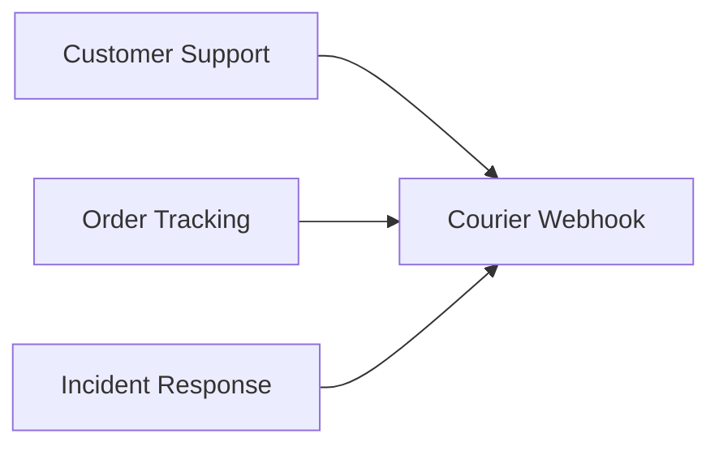
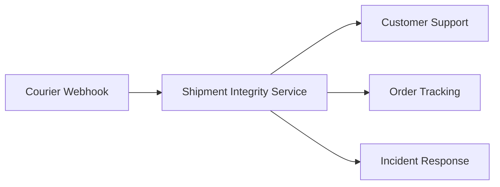
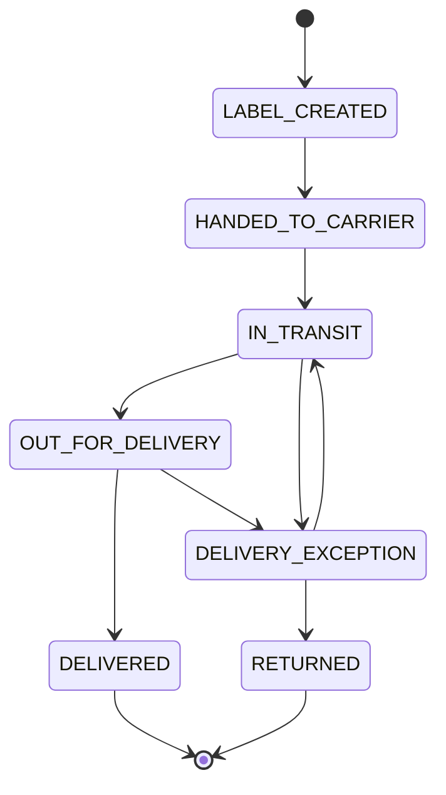
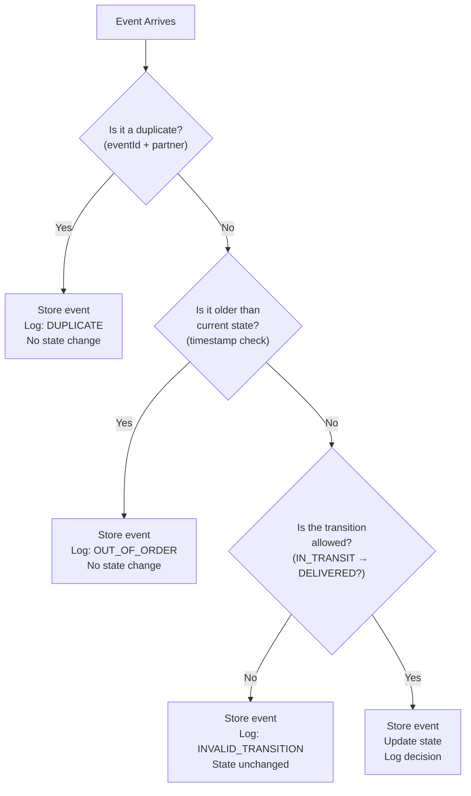
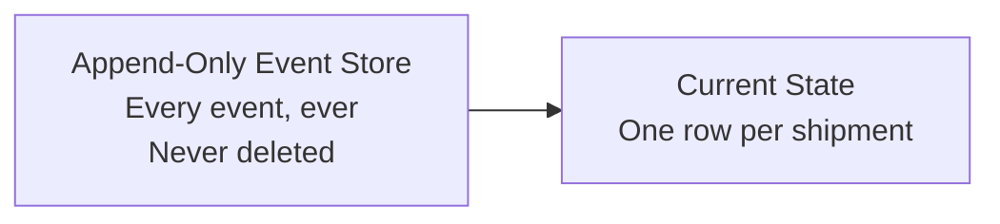
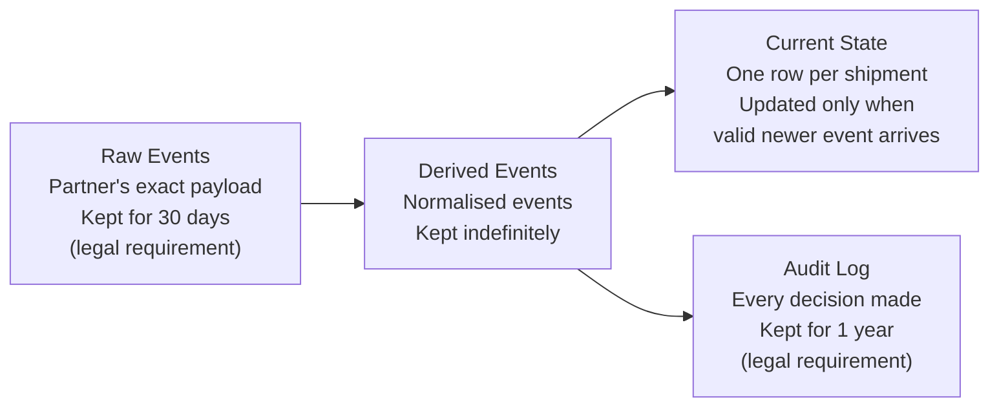
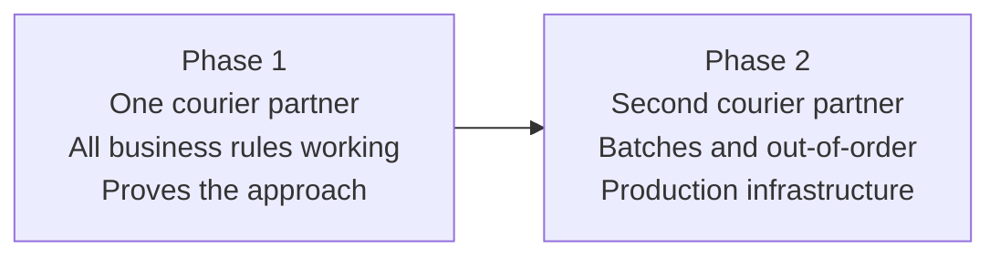

# Whiteboard Walkthrough

**Purpose:** Explain the shipment integrity service to a non-technical stakeholder in 10 minutes.
**Style:** Plain language, no jargon.

---

## Project Context

The client runs an e-commerce platform that ships orders through a courier partner. A recurring integrity problem exists: downstream systems disagree about shipment state because courier events arrive late, out of order, duplicated, or with conflicting data. Customer support, order tracking, and incident response need a trustworthy view of what happened and what the current shipment status is.

**Goals**

- Provide a reliable, authoritative current view of each shipment
- Maintain a queryable history of all shipment events and how the current state was derived
- Handle the core data integrity challenges: duplicates, out-of-order arrival, and conflicting updates
- Deliver a pragmatic, phased solution that can ship to production incrementally

---

## 1. The Problem (2 minutes)

> All three teams listen to the same webhook. All three try to figure out what happened and what the current state of a shipment is — and each team derives the answer independently. Without a centralised service to apply the rules consistently, every team ends up with a different answer. Duplicates, late arrivals, and conflicting updates make this genuinely hard. No one has built the authoritative answer yet.

---

## 2. The Solution (1 minute)

> Before: all three teams listened to the same webhook and each tried to work out the current state themselves. Each team applied their own rules for duplicates, ordering, and conflicts — and got different answers.
>
> After: we build one central service that applies the correct rules once. Downstream teams stop deriving state themselves and ask this service instead. One answer, derived the same way every time.

---

## 3. The Status Diagram (2 minutes)

> A shipment can only move through these paths. Once DELIVERED or RETURNED — it's closed. If a courier sends an event a week later saying the shipment was in transit, we record it for the audit trail but we don't reopen the shipment. This prevents the most common data corruption: a shipment accidentally reverting to an earlier state.

**Two things the system does not require:**

*First event is not LABEL_CREATED:* The system accepts any valid first event. If the first event received is `IN_TRANSIT`, it is accepted. We do not require `LABEL_CREATED` to be first — courier partners don't always send the label creation event, and enforcing it would block valid shipments from being tracked.

*Intermediate states are not required:* A shipment can skip intermediate states as long as the path is valid. `LABEL_CREATED → IN_TRANSIT` is fine even if `HANDED_TO_CARRIER` was never sent. We don't infer missing states — we simply accept that the current state is whatever the most recent valid event says it is.

---

## 4. What the Service Does (3 minutes)

> Every event is recorded. Every decision is logged. State only moves forward through valid transitions. Nothing is deleted or overwritten.

Key points to emphasise:
- **Older event arrives?** → recorded but doesn't change anything. We keep the newer truth.
- **Duplicate?** → recorded but ignored. Same decision every time.
- **Invalid transition?** → recorded and rejected. State stays where it is.
- **Terminal state (DELIVERED, RETURNED)?** → final. Nothing changes it.

---

## 5. The Data Model (1 minute)

**Before (Phase 1 original):**

> Phase 1 had one append-only event store: every event, never deleted. Simple and correct for the original scope.

**After (Phase 1 updated — change request):**

> The change request introduced legal retention requirements that changed the data model:
>
> **Raw events** — the partner's exact payload, kept for 30 days. Required by law — we must show what the partner sent. Deleted after 30 days unless the shipment is in a terminal state.
>
> **Derived events** — normalised events that passed validation and deduplication. Kept indefinitely. The clean canonical record.
>
> **Audit log** — every decision: accepted, rejected, duplicate, out-of-order. Kept for 1 year by law. Even after raw events are deleted, we can still explain each decision.
>
> **Current state** — one row per shipment, updated only when a valid newer event arrives. Always derivable from derived events.

---

## 6. Phase 1 vs Phase 2 (1 minute)

> Phase 1 proves the centralising logic works for one courier partner. We demonstrate correct and consistent answers where the downstream teams were getting inconsistent ones.
>
> Phase 2 adds the second courier partner — who sends events in batches and frequently out of order — plus the production infrastructure needed to run this as a real service.

---

## Tips for the Presenter

- **Keep it visual** — draw each step as you talk, don't use slides
- **Emphasise the "one answer" story** — the core value proposition is consistency, not just correctness
- **Anticipate the "what if you're wrong?" question** — answer: "every decision is logged, we can replay and recompute at any time"
- **If they ask about Partner B** — mention batches and out-of-order as the reason for Phase 2, not Phase 1 scope
- **The status diagram is the strongest visual** — spend the most time on it and invite questions
