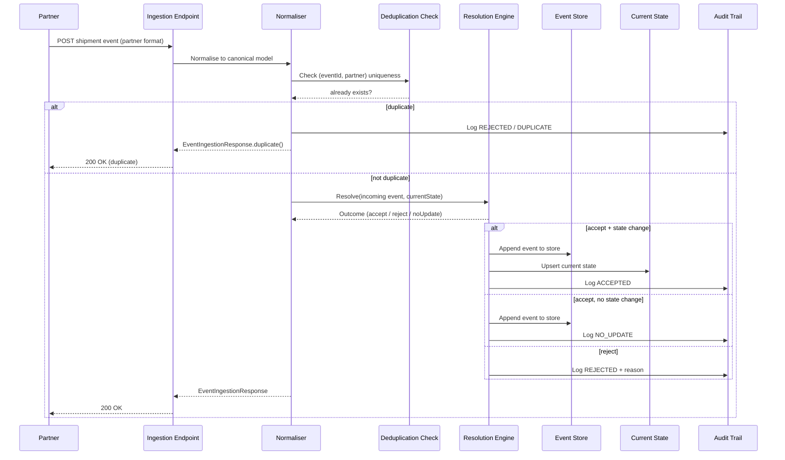
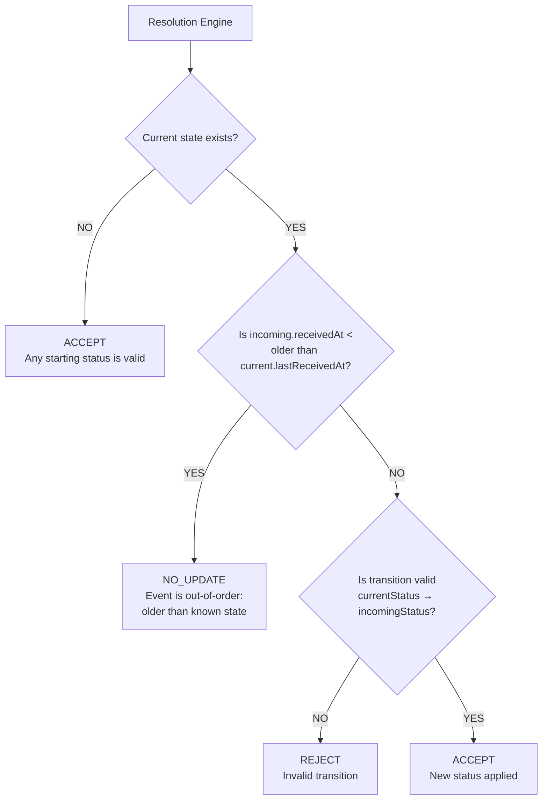
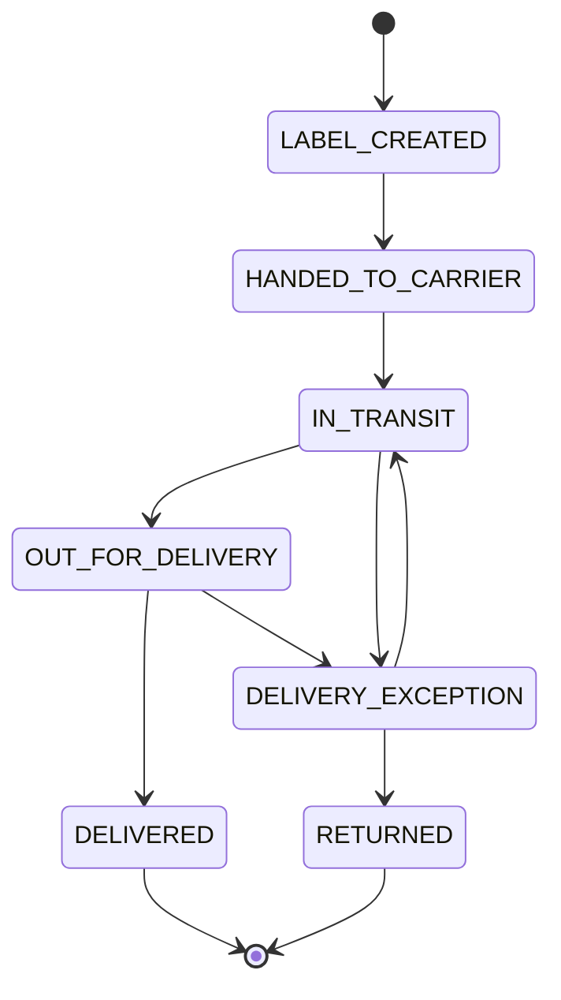
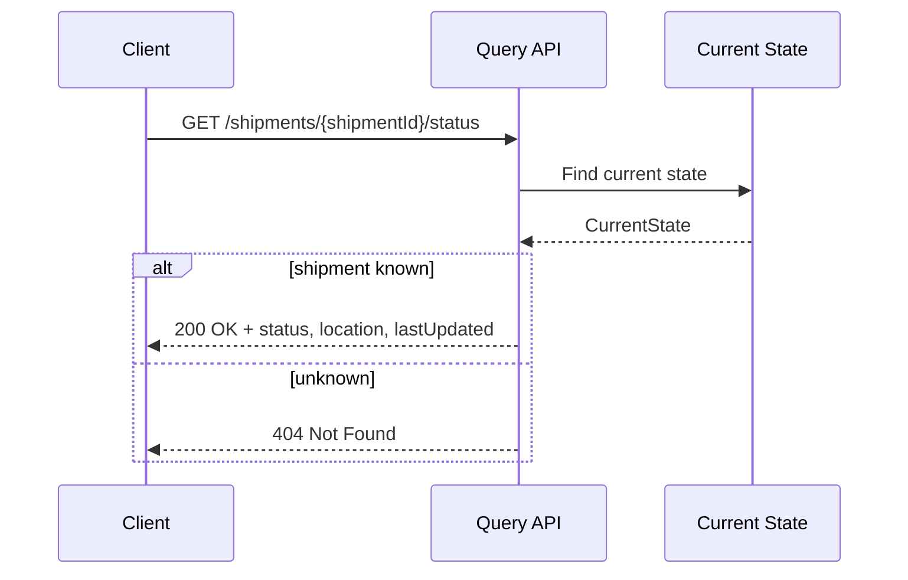
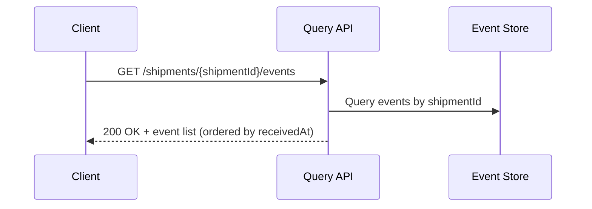
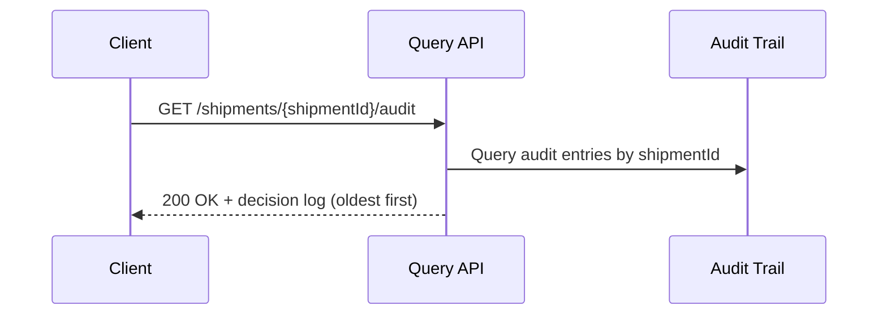

# Sequence Diagrams

**Date:** 2026-06-15

---

## Event Ingestion

---

## Resolution Decision Logic

---

## Status Transitions

---

## Query APIs

### Get Current Status

### Get Event History

### Get Audit Log

