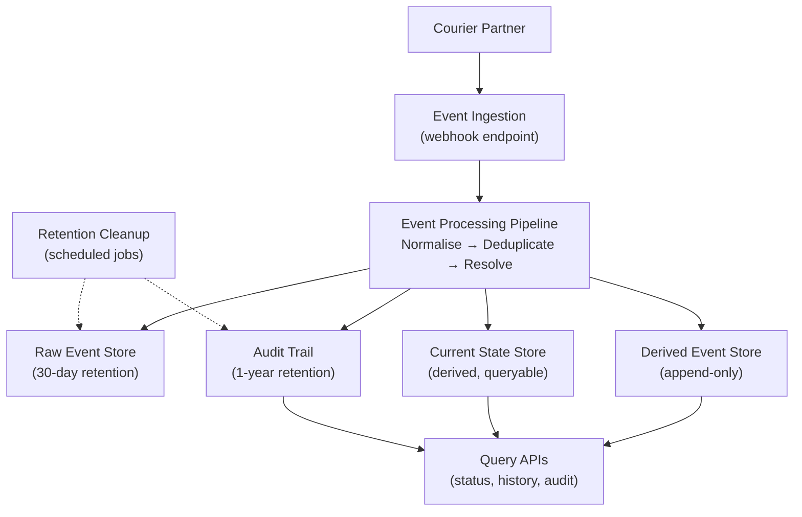
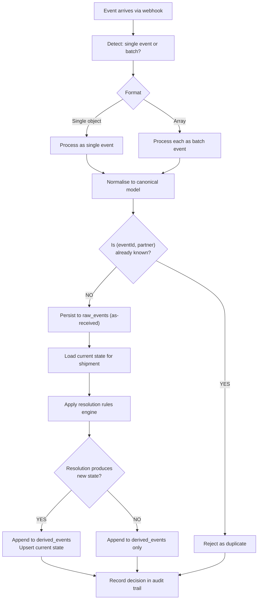
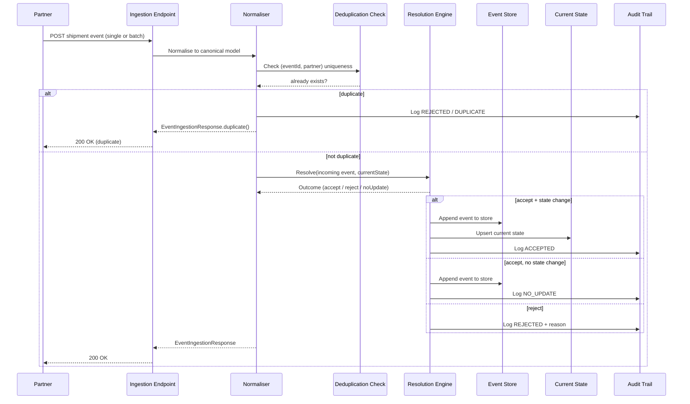
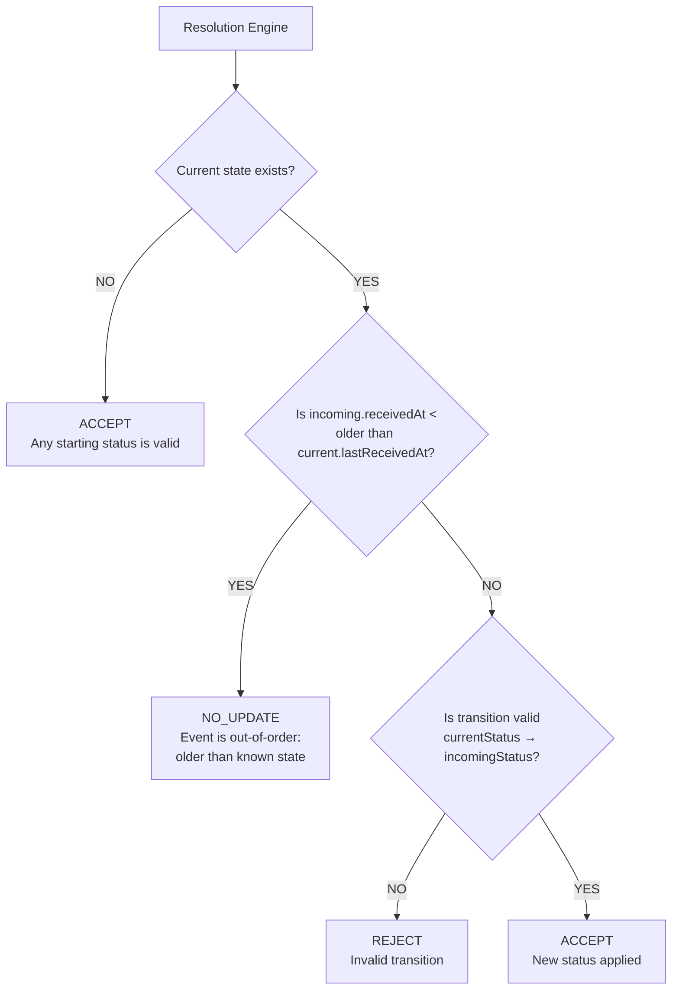
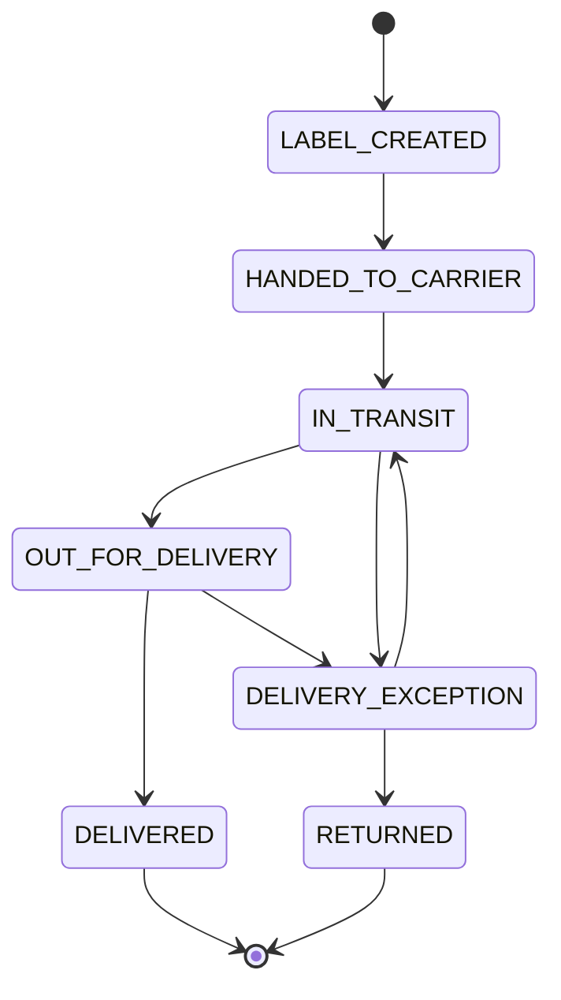
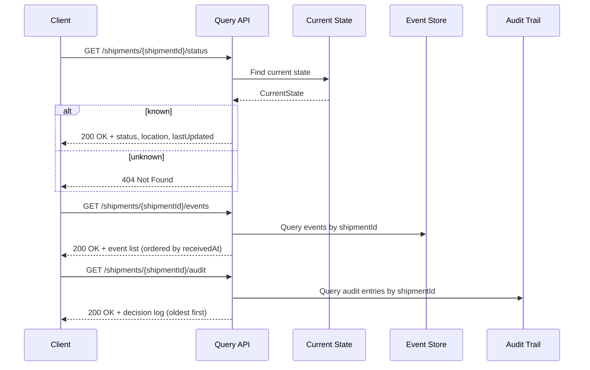

# Shipment Integrity Service — Technical Assessment Submission

**Date:** 2026-06-15

**Author:** Jan van der Lith

**Repository:** https://github.com/JanVDL1975/accso-tech-assessment

---

## Table of Contents

1. [Overview](#1-overview)
2. [Requirements](#2-requirements)
3. [Architecture](#3-architecture)
4. [Architecture Decision Records](#4-architecture-decision-records)
5. [Sequence Diagrams](#5-sequence-diagrams)
6. [API Documentation](#6-api-documentation)
7. [Technical Strategy](#7-technical-strategy)
8. [Delivery Plan](#8-delivery-plan)
9. [Risk Register](#9-risk-register)
10. [Unit Tests](#10-unit-tests)

---

## 1. Overview

### Project Context

The client runs an e-commerce platform that ships orders through courier partners. A recurring integrity problem exists: downstream systems disagree about shipment state because courier events arrive late, out of order, duplicated, or with conflicting data. Customer support, order tracking, and incident response need a trustworthy view of what happened and what the current shipment status is.

This service establishes a **single source of truth** for shipment state, built on an append-only event audit log. The answer must be reliable and explainable.

### Goals

1. Provide a reliable, authoritative current view of each shipment
2. Maintain a queryable history of all shipment events and how the current state was derived
3. Handle the core data integrity challenges: duplicates, out-of-order arrival, and conflicting updates
4. Deliver a pragmatic, phased solution that can ship to production incrementally

### Scope

**In Scope:**
- Technical strategy memo for client engineering lead
- Phased delivery plan with risk register
- One thin executable slice demonstrating the approach
- Architecture decision records (ADRs)
- Batch ingestion for multi-event partner payloads
- Legal retention enforcement (30-day raw, 1-year audit)

**Out of Scope:**
- Complete platform build
- Full CI/CD infrastructure just for show
- Feature breadth beyond data integrity
- End-customer facing tracking portal
- Real-time push notifications

### Tech Stack

- **Runtime:** Java 17, Spring Boot 3.5.0, Maven
- **Persistence:** SQLite with Spring Data JPA / Hibernate
- **Port:** `8080`

---

## 2. Requirements

### Functional Requirements

| ID | Requirement | Description |
|----|-------------|-------------|
| FR-1 | Event Ingestion | Receive shipment events from a courier partner via webhook as a single event or batch |
| FR-2 | Deduplication | Detect and collapse duplicate events based on `(eventId, partner)` — per-partner uniqueness |
| FR-3 | Out-of-Order Handling | Handle events arriving out of chronological order using `receivedAt` as authoritative timestamp |
| FR-4 | Conflict Resolution | Apply a deterministic rules engine when events conflict; terminal states cannot be overridden |
| FR-5 | Status Governance | Enforce the canonical status taxonomy; only valid transitions are accepted |
| FR-6 | Current State Derivation | Maintain a reliable, queryable current state per shipment |
| FR-7 | Audit Trail | Store every event and every state derivation decision with rationale |
| FR-8 | Retention Cleanup | Enforce legal retention: raw payloads deleted after 30 days, audit decisions retained for 1 year |

### Non-Functional Requirements

| ID | Requirement | Description |
|----|-------------|-------------|
| NFR-1 | Event Identifier Handling | `eventId` and `shipmentId` are opaque strings owned by the partner — no assumptions about format |
| NFR-2 | Timestamp Reliability | `occurredAt` is partner-supplied and unreliable; `receivedAt` is used as ordering authority |
| NFR-3 | Trust Boundary | Partner is the integration boundary — events arrive pre-aggregated via webhook |
| NFR-4 | Hosting and Stack | No prescribed stack — Java 17 / Spring Boot 3 chosen and justified |
| NFR-5 | Legal Retention | Raw partner payloads: 30-day retention. Audit decisions: 1-year retention. Terminal-state shipments exempt |

### Status Transitions

```
LABEL_CREATED → HANDED_TO_CARRIER → IN_TRANSIT → OUT_FOR_DELIVERY → DELIVERED
                                              ↘ DELIVERY_EXCEPTION ↗
                                              ↘ RETURNED ↗
DELIVERED and RETURNED are terminal — all further events are rejected
```

### Example Event

```json
{
  "eventId": "evt-123",
  "partner": "dhl",
  "shipmentId": "ship-456",
  "status": "IN_TRANSIT",
  "occurredAt": "2026-03-10T12:00:00Z",
  "receivedAt": "2026-03-10T12:00:05Z",
  "location": "Amsterdam"
}
```

---

## 3. Architecture

### Component Boundaries



### Event Processing Flow



### Resolution Outcomes

| Outcome | Meaning | Stored |
|---------|---------|--------|
| Accept with state change | Event is valid and updates current status | Event + new state + audit decision |
| Accept, no state change | Event is valid but older than known state | Event + audit decision |
| Reject | Event violates transition rules | Audit decision with reason |

### Data Stores

| Store | Retention | Description |
|-------|-----------|-------------|
| `raw_events` | 30 days | Raw partner payloads, as-received before processing |
| `derived_events` | Indefinite | Canonical events that passed validation and deduplication |
| `shipment_current_state` | Indefinite | Derived current state, updated on valid newer events |
| `audit_log` | 1 year | Every resolution decision with rationale |

Terminal-state shipments (`DELIVERED`, `RETURNED`) are exempt from retention cleanup.

---

## 4. Architecture Decision Records

### ADR-001: Use `receivedAt` for Event Ordering

**Status:** Accepted

`occurredAt` is partner-supplied and can be backfilled or clock-skewed. `receivedAt` is used as the authoritative timestamp for event ordering and out-of-order detection. When an incoming event's `receivedAt` is before the current state's last `receivedAt`, the event does not update state — it is still recorded for traceability.

`occurredAt` is stored for audit purposes but not used for ordering decisions.

**Alternatives considered:** `occurredAt` as ordering authority (rejected — too unreliable given Partner B's frequent backfills); wall-clock at ingestion (rejected — loses relationship between timestamps); grace window (deferred — not implemented in Phase 1, should be calibrated with observed data before Partner B onboarding).

---

### ADR-002: Append-Only Event Store with Derived Current State

**Status:** Accepted

Two separate data structures: an append-only event store (source of truth for history and replay) and a derived current state (fast path for status queries). The current state can be rebuilt at any time by replaying the event store.

**Alternatives considered:** Replay all events on every query (rejected — too slow); overwrite status on every event (rejected — loses history); periodic snapshots (deferred — not needed in Phase 1).

---

### ADR-003: Per-Partner `(partner, eventId)` as Deduplication Key

**Status:** Accepted

Deduplication is scoped to the partner using `(partner, eventId)` as the uniqueness key. The same `eventId` value can exist in multiple partners' systems without conflict.

**Alternatives considered:** Global deduplication key (rejected — `eventId` is not globally unique); `(eventId, partner, payloadHash)` (deferred — would detect payload-corrected retries but adds complexity).

---

### ADR-004: Deterministic, Stateless Conflict Resolution

**Status:** Accepted

A stateless resolution engine evaluates each incoming event against the current known state. Rules applied in order: (1) no current state → accept; (2) out-of-order → no-update; (3) invalid transition → reject; (4) valid transition → accept with state change. Every decision is recorded in the audit trail.

**Alternatives considered:** Stateful resolver with event history access (rejected — harder to test and reason about); externalised rules engine (deferred — adds complexity not justified by Phase 1 requirements).

---

### ADR-005: Batch Per-Event Isolation

**Status:** Accepted

When a batch of events arrives, each event is processed individually through the standard event processing pipeline. One bad event does not poison the batch. The response reports accepted, rejected, and duplicate counts so the caller can act on failures.

**Alternatives considered:** Atomic all-or-nothing batch (rejected — one bad event would block all valid events in the batch); first-error abort (rejected — same reason).

---

### ADR-006: Split Retention — 30-Day Raw Events, 1-Year Audit Log

**Status:** Accepted

Legal requires two different retention windows: raw partner payloads deleted after 30 days; audit decisions retained for 1 year. Terminal-state shipments are exempt from both cleanup schedules. Two scheduled jobs enforce the schedules daily.

**Alternatives considered:** Single unified retention schedule (rejected — legal requirements differ); indefinite retention (rejected — violates legal requirement); retain all raw events indefinitely (rejected — violates legal requirement).

---

## 5. Sequence Diagrams

### Event Ingestion



### Resolution Decision Logic



### Status Transitions



### Query APIs



---

## 6. API Documentation

**Base URL:** `http://localhost:8080`

### Endpoints

| Method | Path | Description |
|--------|------|-------------|
| POST | `/api/v1/shipments/events` | Single event or batch (auto-detected) |
| GET | `/api/v1/shipments/{shipmentId}/status` | Current shipment status |
| GET | `/api/v1/shipments/{shipmentId}/events` | Event history ordered by `receivedAt` |
| GET | `/api/v1/shipments/{shipmentId}/audit` | Audit decision log |
| GET | `/health` | Health check |

---

### POST `/api/v1/shipments/events`

Accepts both a single event and a batch of events. Format is auto-detected based on the JSON structure.

**Single event request:**
```json
{
  "eventId": "evt-123",
  "partner": "dhl",
  "shipmentId": "ship-456",
  "status": "LABEL_CREATED",
  "occurredAt": "2026-03-10T12:00:00Z",
  "receivedAt": "2026-03-10T12:00:05Z",
  "location": "Amsterdam"
}
```

**Batch request (bare array):**
```json
[
  {
    "eventId": "evt-1",
    "partner": "dhl",
    "shipmentId": "ship-456",
    "status": "LABEL_CREATED",
    "occurredAt": "2026-03-10T12:00:00Z",
    "receivedAt": "2026-03-10T12:00:05Z"
  },
  {
    "eventId": "evt-2",
    "partner": "dhl",
    "shipmentId": "ship-456",
    "status": "HANDED_TO_CARRIER",
    "occurredAt": "2026-03-10T13:00:00Z",
    "receivedAt": "2026-03-10T13:00:05Z"
  }
]
```

**Single event response:**
```json
{ "accepted": true, "eventId": "evt-123" }
```

**Batch response:**
```json
{
  "totalReceived": 2,
  "acceptedCount": 2,
  "rejectedCount": 0,
  "duplicateCount": 0,
  "results": [
    { "accepted": true, "eventId": "evt-1" },
    { "accepted": true, "eventId": "evt-2" }
  ]
}
```

---

### GET `/api/v1/shipments/{shipmentId}/status`

Returns the current state of a shipment.

**Response (200 OK):**
```json
{
  "shipmentId": "ship-456",
  "currentStatus": "IN_TRANSIT",
  "lastReceivedAt": "2026-03-10T14:00:00Z",
  "location": "Berlin"
}
```

**Response (404 Not Found):** Shipment not found.

---

### GET `/api/v1/shipments/{shipmentId}/events`

Returns the full event history for a shipment, ordered by `receivedAt` ascending. Only accepted events are stored.

**Response (200 OK):**
```json
[
  {
    "eventId": "evt-1",
    "shipmentId": "ship-456",
    "partner": "dhl",
    "status": "LABEL_CREATED",
    "occurredAt": "2026-03-10T12:00:00Z",
    "receivedAt": "2026-03-10T12:00:05Z",
    "location": "Amsterdam"
  }
]
```

---

### GET `/api/v1/shipments/{shipmentId}/audit`

Returns the audit decision log for a shipment, ordered by `createdAt` ascending.

**Response (200 OK):**
```json
[
  {
    "eventId": "evt-1",
    "shipmentId": "ship-456",
    "partner": "dhl",
    "previousStatus": null,
    "newStatus": "LABEL_CREATED",
    "decision": "ACCEPTED",
    "rejectionReason": null,
    "receivedAt": "2026-03-10T12:00:05Z",
    "createdAt": "2026-03-10T12:00:06Z"
  }
]
```

---

### GET `/health`

**Response (200 OK):**
```json
{ "status": "UP" }
```

---

## 7. Technical Strategy

### Problem Framing

Courier partners send shipment status updates via webhook. Downstream systems receive the same shipment's events at different times, in different orders, and sometimes duplicated — leading to inconsistent views of shipment state. Customer support, order tracking, and incident response all need a trustworthy answer to "what is the current status of this shipment and how do we know?"

### Key Assumptions (Confirmed via Client Q&A)

1. **`occurredAt` is partner-supplied and cannot be trusted as a global clock.** Clock skew, varying precision, and backfilled timestamps are to be expected.
2. **`receivedAt` is also partner-supplied.** Represents when the partner first received the event into their system.
3. **`eventId` and `shipmentId` are opaque strings owned by the partner.** Formats vary between couriers.
4. **The partner is the integration and trust boundary.** Events arrive pre-aggregated via webhook.
5. **Second courier onboarding within one quarter.** Partner B sends batched events and frequently sends events out of order.
6. **Legal retention requirements are firm.** Raw payloads: 30-day retention. Audit decisions: 1-year retention.

### Data Integrity Strategy

**Duplicates:** Deduplication is per-partner using `(partner, eventId)`. Duplicate events are logged in the audit trail with a `DUPLICATE` marker and do not alter current state.

**Out-of-Order Events:** `receivedAt` is the authoritative timestamp. Events older than the current known state are recorded but do not update current state. All ordering decisions are recorded in the audit trail.

**Conflicting Updates:** A deterministic rules engine resolves conflicts. Identical event sequences always produce identical state outcomes. Terminal states (`DELIVERED`, `RETURNED`) cannot be overridden.

**Audit Trail Completeness:** The event store is append-only. Every event is stored regardless of outcome. Every state derivation decision is recorded with its rationale.

### Operational Concerns

**Observability signals to track from day one:**
- Duplicate event rate — a high rate indicates partner retry misconfiguration
- Rejection rate by reason — spikes indicate partner payload issues or schema drift
- Event processing latency — P99 by partner
- Current state staleness — how old is the last update per shipment
- Batch size distribution — volume of events per batch for Partner B

**Failure handling:**

| Failure Mode | Behaviour |
|-------------|-----------|
| Persistence fails | Transaction rolls back; client receives error; partner retry will succeed |
| Malformed payload | 400 returned immediately; event not stored |
| Resolver encounters invalid state | 500 returned; event not acknowledged; partner retry |
| Unknown shipmentId on first event | Create new shipment record — expected for new shipments |
| Batch contains one bad event | Other events in the batch continue to be processed normally |

**Ownership boundaries:**

| Component | Owner | Notes |
|-----------|-------|-------|
| Event ingestion API | Engineering | Interface contract with partner |
| State resolution rules | Engineering + Product | Business rules; changes require review |
| Audit trail | Legal & Compliance | Retention policy enforcement |
| Metrics and alerting | Operations | Observability stack |

### Open Questions for the Client

1. **Partner B timeline** — Is one quarter confirmed or aspirational? What does "onboarded" mean — generic batch ingestion or full partner-specific integration?
2. **Out-of-order frequency** — What percentage of Partner B's events arrive out of order? Do you expect us to handle it silently or flag it?
3. **Grace window** — Do you need a grace window before applying events? Without it, many of Partner B's out-of-order events will arrive but not update state.
4. **Legal retention confirmation** — Are the 30-day raw / 1-year audit schedules confirmed as firm legal requirements?

---

## 8. Delivery Plan

### Phase 1 — Foundation

**Objective:** Demonstrate the core approach with a working, testable slice.

**Scope:**
- Single-partner event ingestion endpoint (HTTPS POST)
- Canonical event model and normalisation
- Deduplication logic (per-partner `eventId`)
- Out-of-order event handling with `receivedAt` ordering
- Conflict resolution rules engine (deterministic, stateless)
- Append-only event store with audit trail
- Current state derivation per shipment
- Queryable current state by `shipmentId`
- Batch ingestion (bare array of events, auto-detected)
- Raw event store with 30-day retention (legal requirement)
- Audit decision log with 1-year retention (legal requirement)
- Scheduled retention cleanup jobs

**Minimum Credible First Slice:** An ingestion endpoint with normalisation, deduplication, batch processing, state derivation, retention cleanup, and tests. No CI/CD infrastructure, no metrics dashboard, no containerisation beyond what directly supports the slice.

**Success Signals:**
- Duplicate events are detected and logged without altering state
- Out-of-order events are handled deterministically with decisions recorded in the audit trail
- Conflicting events are resolved by the rules engine; terminal states are enforced
- Current state is queryable by `shipmentId`
- Audit trail explains every state derivation decision
- Batch ingestion processes each event independently; one bad event does not poison the batch
- Raw events are deleted after 30 days; audit log entries are deleted after 1 year
- Terminal-state shipments are exempt from retention cleanup

**Duration:** Approximately 2–3 weeks for a solo developer, assuming no blocking dependencies.

### Phase 2 — TBD (Post-Change Request)

To be planned via formal change request. Expected areas:
- Metrics, alerting, and observability
- Hosting model finalisation and production deployment
- Multi-partner normalisation layer (partner-specific payload mapping)
- Grace window for out-of-order events

### Dependencies and Blockers

| Dependency | Owner | Notes |
|------------|-------|-------|
| Partner API contract | Courier partner | Needed for normalisation layer |
| Tech stack decisions | Engineering | Must be justified and documented |
| Open questions resolved | Client | Partner B timeline, out-of-order frequency, grace window |
| Legal retention confirmation | Legal & Compliance | 30-day raw / 1-year audit must be confirmed as firm |

---

## 9. Risk Register

| # | Risk | Likelihood | Impact | Mitigation |
|---|------|-------------|---------|------------|
| R1 | `receivedAt` clock skew causes wrong event ordering | High | High | Use `receivedAt` as tiebreaker; implement a grace window for near-order events; log all ordering decisions in audit trail |
| R2 | Partner sends same `eventId` with a different payload on retry | Medium | Medium | Log and reject duplicates; assess whether payload hash tracking is needed in Phase 2 |
| R3 | Terminal state enforcement gaps — invalid transitions accepted | Medium | High | Explicit status transition rules; `DELIVERED` and `RETURNED` block all further updates |
| R4 | Write bottleneck at scale (SQLite single-writer) | Medium | Medium | Define a clear migration trigger; document PostgreSQL migration path for Phase 2 |
| R5 | New status value needed from partner | Medium | Medium | Version the resolver interface; define a review process for adding new statuses |
| R6 | Out-of-order grace window too strict or too lenient | Medium | Medium | Start with a narrow window; adjust based on observed partner behaviour; log all borderline cases |
| R7 | Partner payload schema drift | Medium | Low | Validate at ingestion boundary; maintain schema versioning for normaliser |
| R8 | Partner B sends fundamentally different event shapes requiring partner-specific logic | Medium | High | Keep the resolver stateless and generic; defer partner-specific normalisation to Phase 2 |
| R9 | Retention cleanup deletes events still in dispute (e.g., legal hold) | Low | High | Terminal-state shipments are exempt from cleanup; per-shipment retention flags in Phase 2 |
| R10 | Partner B frequently sends events out of order — state is frequently wrong | Medium | High | Grace window not implemented in Phase 1; defer for calibration based on observed data |
| R11 | Audit log grows unbounded for active shipments | Low | Medium | Monitor growth rate; consider snapshot-based compaction for long-running shipments in Phase 2 |

**R1 is the highest-priority risk.** Since `receivedAt` is partner-supplied and unreliable as a global clock, the architecture must not depend on it being monotonically increasing. The grace window is the primary mitigation and should be implemented before Partner B onboarding.

**R3 is the highest-impact risk.** If terminal states are not enforced correctly, a late event could re-open a delivered or returned shipment, causing incorrect state across all downstream systems.

**R8 is the new highest-likelihood risk introduced by Partner B.** If Partner B's events require partner-specific resolution logic, the stateless generic resolver will be insufficient. This should be validated early.

---

## 10. Unit Tests

### Test Results

```
Tests run: 28, Failures: 0, Errors: 0, Skipped: 0
BUILD SUCCESS
```

| Test Class | Tests | Status |
|-----------|-------|--------|
| `ShipmentIntegrationTest` | 11 | All passing |
| `ShipmentStatusTest` | 11 | All passing |
| `DefaultShipmentStateResolverTest` | 6 | All passing |

### Test Coverage

**`ShipmentIntegrationTest`** — End-to-end API tests covering:
- Single event acceptance
- Duplicate rejection
- Current state updates
- Event history queries (ordered by `receivedAt`)
- Batch ingestion (multiple events, duplicates within batch, per-event atomicity)
- Audit log decision history
- Health check endpoint
- Unknown shipment returns 404

**`ShipmentStatusTest`** — Domain tests covering all allowed status transitions and rejection of invalid transitions.

**`DefaultShipmentStateResolverTest`** — Resolver logic tests covering:
- Accept when no current state
- Reject out-of-order events
- Reject invalid transitions
- Accept valid transitions
- Terminal state enforcement (`DELIVERED`, `RETURNED` block all further events)

### Running the Tests

```bash
# Run all tests
mvn test

# Run a specific test class
mvn test -Dtest=ShipmentIntegrationTest
mvn test -Dtest=ShipmentStatusTest
mvn test -Dtest=DefaultShipmentStateResolverTest
```

---

## Common Commands

```bash
# Build
mvn clean package

# Run the application
mvn spring-boot:run

# Run tests
mvn test
```
