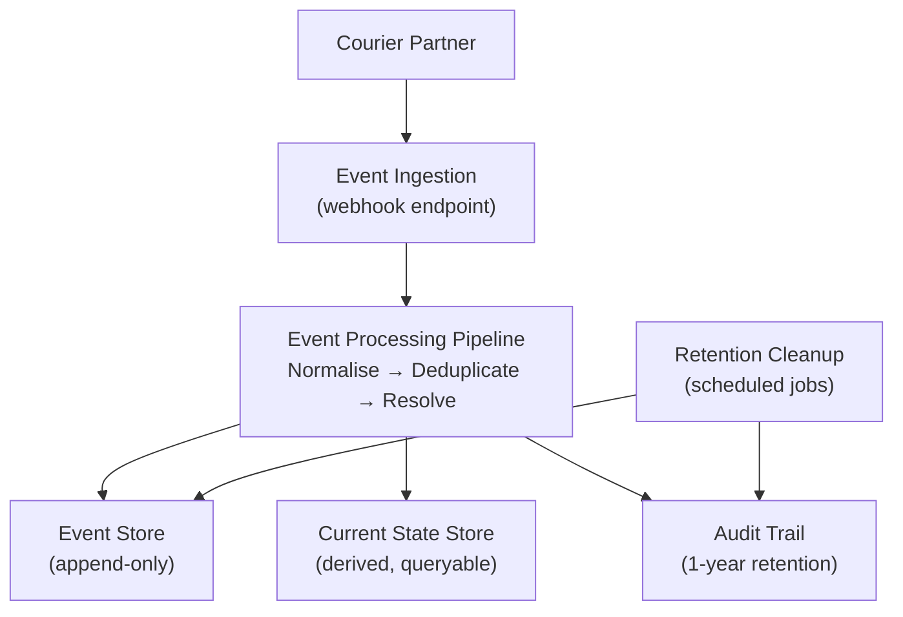
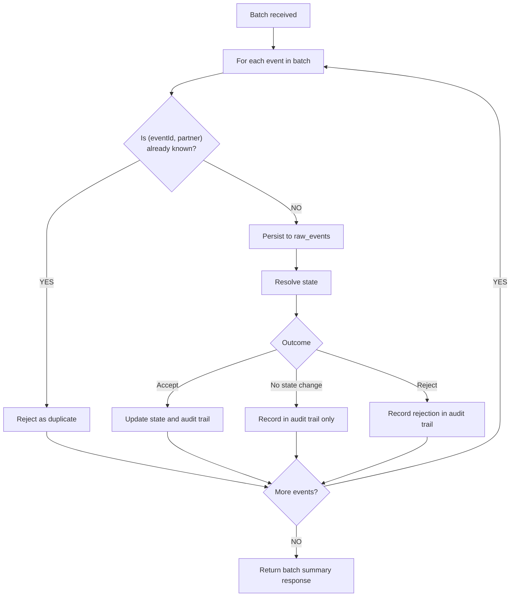
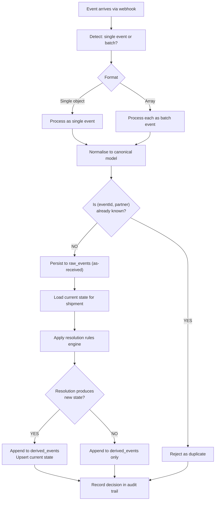

# Technical Strategy Memo

**Date:** 2026-06-15
**Status:** Draft - for client engineering lead review
**Audience:** Technical and business decision-makers

---

## 1. Problem Framing and Scope

### What We Are Solving

Courier partners send shipment status updates via webhook. The core problem is that downstream systems receive the same shipment's events at different times, in different orders, and sometimes duplicated - leading to inconsistent views of shipment state. Customer support, order tracking, and incident response all need a trustworthy answer to "what is the current status of this shipment and how do we know?"

This service establishes a **single source of truth** for shipment state, built on an append-only event audit log. The answer must be reliable and explainable.

### What We Are Not Solving

- Customer-facing tracking UI - backend service only
- Real-time push notifications - query-based access only for now
- Courier contract management or billing
- Multi-partner normalisation beyond generic ingestion - each partner brings their own payload quirks; a normalisation layer per partner is Phase 2 territory

### What Good Looks Like

- A single, queryable current state per shipment that reflects all known events
- A complete, append-only event history that can explain how that state was derived
- Deterministic, explainable handling of duplicates, out-of-order arrivals, and conflicting updates
- Raw partner payloads retained for 30 days (legal requirement); audit decisions retained for 1 year
- Batch ingestion that processes each event individually without one bad event poisoning the batch

---

## 2. Key Assumptions and Open Questions

### Confirmed via Client Q&A

1. **`occurredAt` is partner-supplied and cannot be trusted as a global clock.** Clock skew between couriers, varying precision, and backfilled timestamps are to be expected. Design for it rather than around it.

2. **`receivedAt` is also partner-supplied.** It represents when the partner first received the event into their system - not when we ingested it. Both timestamps are unreliable for cross-partner ordering.

3. **`eventId` and `shipmentId` are opaque strings owned by the partner.** Formats vary between couriers. Do not assume UUID format, sequential ordering, or cross-partner uniqueness.

4. **The partner is the integration and trust boundary.** Events arrive pre-aggregated via webhook, not pushed directly from driver handhelds. No requirement to validate against courier internal systems.

5. **Events arrive via HTTPS POST webhook.** No push-based streaming protocol required.

6. **Second courier onboarding within one quarter.** The incoming partner sends batched events (not one at a time) and frequently sends events out of order.

7. **Legal retention requirements are firm:**
   - Raw partner payloads must be deleted after 30 days
   - Audit decisions (derived state change rationale) must remain queryable for 1 year

### Open Questions for the Client

1. **Second courier timeline** - is the one-quarter target confirmed or aspirational? This drives delivery prioritisation.

2. **Partner B out-of-order frequency** - "frequently out of order" is vague. What volume of events are we talking about? Is the partner aware their events arrive out of order, and do they expect us to handle it silently or flag it?

3. **Grace window for out-of-order events** - we do not currently implement a grace window. Do we need one? If Partner B frequently sends older events alongside newer ones, a grace window determines whether we hold or apply them.

4. **Shipment ID lifecycle** - can a `shipmentId` be reused after a return? If so, the current-state store needs a reset mechanism.

5. **Duplicate payload handling** - if a retry has the same `eventId` but a different payload, the second is silently rejected. Is payload hash or version tracking needed?

6. **Hosting model and stack** - no house stack is prescribed. We will decide and justify.

---

## 3. Proposed Architecture

### Component Boundaries

### Batch Processing

Partners that send events in bulk rather than one at a time use the same endpoint. The batch is not processed as a single atomic unit — each event is passed individually through the standard event processing pipeline. This means:

- **One bad event does not poison the batch** — if one event fails validation or causes a resolver rejection, the others continue to be processed
- **Ordering within the batch is not guaranteed** — events within a batch may arrive out of order relative to each other, and the same `receivedAt`-based ordering rules apply
- **Deduplication applies per-event** — each event in the batch is checked for `(eventId, partner)` uniqueness independently
- **Partial success is expected** — the response reports how many events were accepted, rejected, and duplicated

The batch processing flow:

### Event Processing Flow

### Where Hard Decisions Live

| Decision | Location | Approach |
|----------|----------|----------|
| Which event wins in a conflict | Resolution rules engine | Deterministic: latest `receivedAt` within allowed transition path |
| Out-of-order handling | Resolution rules engine | Reject events older than current state; document the decision in audit trail |
| Duplicate detection | Deduplication layer | Per-partner `eventId` uniqueness; duplicates logged but do not alter state |
| Terminal state enforcement | Status transition rules | `DELIVERED` and `RETURNED` are terminal - no further events accepted |
| Batch per-event isolation | Event processing pipeline | Each event processed independently; failures do not cascade |

---

## 4. Data Integrity Strategy

### Duplicates

- Deduplication is per-partner using `(partner, eventId)` as the uniqueness key
- Duplicate events are logged in the audit trail with a `DUPLICATE` marker
- Duplicate events do not alter current state
- The deduplication window is the lifetime of the shipment record

### Out-of-Order Events

- Events are ordered by `receivedAt` when deriving state
- The system does not assume `receivedAt` is monotonically increasing
- `occurredAt` is stored for audit but not used for ordering
- Events older than the current known state are rejected; events within a grace window are accepted with a flag (grace window not yet implemented)
- All ordering decisions are recorded in the audit trail

### Conflicting Updates

- A deterministic rules engine resolves conflicts
- Identical event sequences always produce identical state outcomes
- Terminal states (`DELIVERED`, `RETURNED`) cannot be overridden by earlier non-terminal states
- All conflict resolution decisions are logged with their rationale

### Audit Trail Completeness

- The event store is append-only - rows are never updated or deleted
- Every event is stored regardless of whether it updated state
- Every state derivation decision is recorded with its rationale
- The audit trail is queryable and can explain how the current state was derived

### Retention

- **Raw events (`raw_events`)**: deleted after 30 days, except for shipments in terminal state (`DELIVERED`, `RETURNED`) which are retained indefinitely. Driven by legal requirement.
- **Audit log (`audit_log`)**: deleted after 1 year, except for shipments in terminal state which are retained indefinitely. Driven by legal requirement.
- **Derived events (`derived_events`)**: no automated purge in Phase 1. Future retention policy TBD.
- Retention cleanup runs as scheduled jobs (daily at 2 AM for raw events, 4 AM for audit log).

---

## 5. Operational Concerns

### Observability

Key signals to track from day one:

- **Duplicate event rate** - a high rate indicates partner retry misconfiguration
- **Rejection rate by reason** - spikes indicate partner payload issues or schema drift
- **Event processing latency** - P99 by partner
- **Current state staleness** - how old is the last update per shipment
- **Batch size distribution** - volume of events per batch for Partner B

### Failure Handling

| Failure Mode | Behaviour |
|-------------|-----------|
| Persistence fails | Transaction rolls back; client receives error; partner retry will succeed |
| Malformed payload | 400 returned immediately; event not stored |
| Resolver encounters invalid state | 500 returned; event not acknowledged; partner retry |
| Unknown shipmentId on first event | Create new shipment record; this is expected for new shipments |
| Batch contains one bad event | Other events in the batch continue to be processed normally |

### Ownership Boundaries

| Component | Owner | Notes |
|-----------|-------|-------|
| Event ingestion API | Engineering | Interface contract with partner |
| State resolution rules | Engineering + Product | Business rules; changes require review |
| Partner payload normalisation | Engineering | Partner-specific mapping (Phase 2) |
| Audit trail | Legal & Compliance | Retention policy enforcement |
| Metrics and alerting | Operations | Observability stack |

---

## 6. Delivery Plan and Risk Register

The phased delivery plan and risk register are maintained as separate documents:

- **DELIVERY_PLAN.md** - Phase breakdown, minimum credible first slice, success signals
- **RISK_REGISTER.md** - Risks, likelihood/impact assessments, and mitigations

---

## 7. Architectural Decisions to Record (ADRs)

The following decisions warrant formal ADR records:

1. **`receivedAt` as ordering authority** - `occurredAt` is partner-supplied and unreliable; `receivedAt` is used as the authoritative timestamp for state derivation
2. **Append-only event store with derived current state** - enables auditability and deterministic replay
3. **Per-partner `(partner, eventId)` deduplication key** - handles partner-scoped IDs without requiring global uniqueness
4. **Deterministic, stateless conflict resolution** - identical event sequences produce identical state
5. **Batch per-event isolation** - one bad event does not poison the batch; each event is processed independently
6. **Split retention: 30-day raw / 1-year audit** - raw payloads deleted on legal schedule; audit decisions retained for compliance

---

*This memo reflects the current state of the analysis as of 2026-06-15. It will be updated as open questions are resolved and Phase 1 deliverables are confirmed.*
